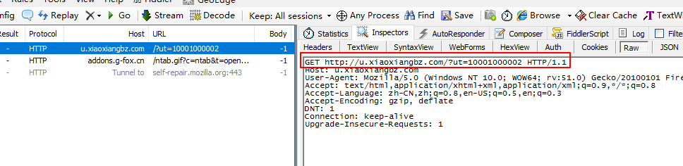
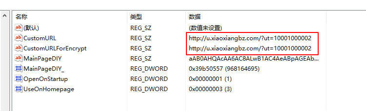

# 7654劫持首页修复

不知道什么时候打开火狐浏览器，首页变成了7654.com，烦死  
火狐的主页是很好修复的，只要在选项里设置一下或者直接打开想要设置的主页，拖到小房子那儿，主页就修改完了  

烦的是新建标签页，不知道去哪里改，试过搜注册表7654.com，然而没什么用  

小伙伴最后把我的网断了，然后再新建标签页，然后发现了一个奇怪的网址  
  
（我这里用fiddler拦截了下，效果差不多）  
发现这个奇怪的网址，然后让请求通过，发现真的跳到了7654  
这样的话，我就去注册表搜 u.xiaoxiangbz.com，找到了两项  
  

然而删掉注册表项也没什么用  

最后找到配置文件夹的一个js，  
```r
C:\Users\hello\AppData\Roaming\Mozilla\Firefox\Profiles\e6kxv2ld.default\prefs.js
```
然后在prefs.js中查到了那个网址，替换成你想要的新标签页网址保存就好了  
```js
user_pref("moa.ntab.web.alturl", "http://offlintab.firefoxchina.cn/");
```


2017/3/7  
