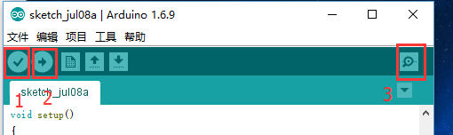
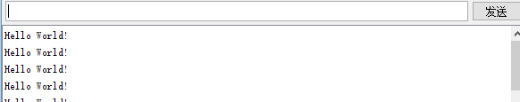

# Arduino---HelloWorld

代码如下：  
```c
void setup()
{
Serial.begin(9600);//设置波特率为9600，这里要跟软件设置相一致。当接入特定设备（如：蓝牙）时，我们也要跟其他设备的波特率达到一致。
}
void loop()
{
Serial.println("Hello World!");//显示“Hello World！”字符串
delay(5000);// 延迟5秒
}
```

编译运行  
  

结果  
  

会看到不停输出的helloworld  


2016/7/8  
