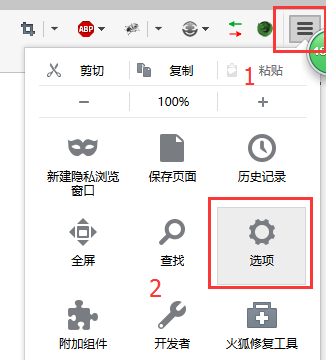
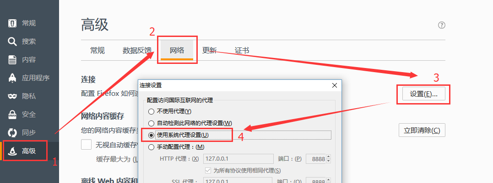
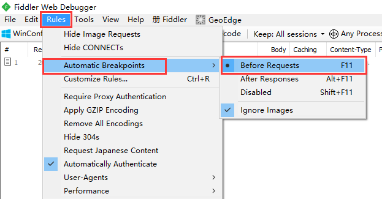
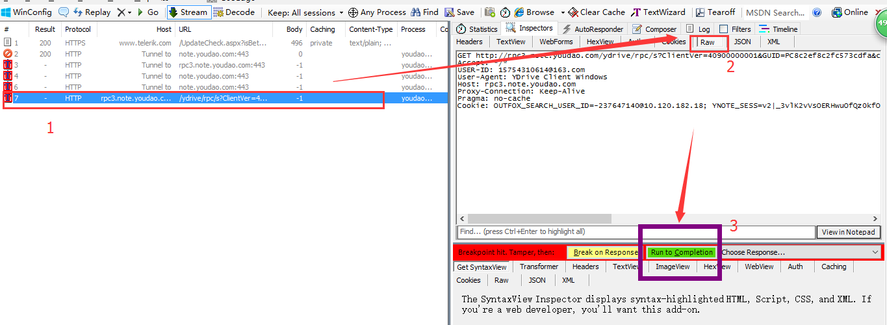

# Fiddler---截取数据包修改重发

先把要使用的浏览器的网络代理设置一下（以火狐为例）  
  
  

然后就改好了  

--------------------------------------------------------------------------------
打开Fiddler，这样设置一下  
  

就可以截取本地包了  

--------------------------------------------------------------------------------
  
1. 点击一个请求
2. 右侧点击 Raw （即原始格式），在下方修改请求信息
3. 点击绿色按钮继续发送请求

--------------------------------------------------------------------------------
这样就是整个过程，详细的教程可以看  
http://kb.cnblogs.com/page/130367/  

---
2016/5/19  
