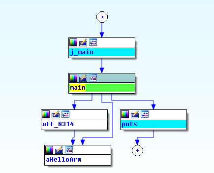
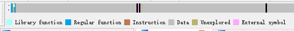
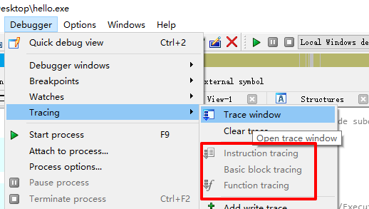

# IDA---杂乱

一些杂乱的内容  

- - -
## 看整体流程
View -> Open subviews -> Proximity Browser  
举例：  
  


- - -
## 修改16进制
点击要修改那一行asm代码，然后菜单Edit->Patch program->Change bytes就可以修改，  
修改完 `Edit -> Patch program -> Apply patches to input file` 就可以保存了。  
在IDA里面修改16进制，修改完可以直接F5重新反汇编，看修改后的代码逻辑。  


- - -
## 使用插件直接修改汇编指令
`Edit -> Plugins -> Keypatch Patcher`  
快捷键: `Ctrl + Alt + K`  
右键也可以看到 `Keypatch Patcher` 的选项(汇编代码模式下)，保存方式如上  
需要注意的是，如果直接修改经过F5的代码，可能会有莫名其妙的问题，所以一定要注意修改的是汇编指令  


- - -
## 数据段部分转字符串
选中名字或光标在相应地址处，`Edit -> Strings -> String`  
也可以在工具栏找对应的图标进行操作  
简单的字符串IDA可以识别，可以右键直接选择  


- - -
## 数字以常量字符串显示
选中数字，右键 `Manual...` 输入字符串即可  


- - -
## 伪C代码与汇编码对照
F5之后的视图下，任意一行的结尾，右键 `Copy to assembly`  
注意：这个操作会删掉汇编代码视图的前后注释  


- - -
## 开启汇编自动注释
`Option -> General -> Auto Comments`  
对一些字符串的显示比较友好  


- - -
## IDA导航带
navigation band, 导航带，我叫它分析条，不同颜色代表不同类型  
```
浅蓝：库函数  
蓝色：正常函数  
灰色：数据段  
... 
```
可以通过导航带来关注各个段，如下示例：  
  


- - -
## IDA代码段地址颜色
如果有疑问，IDA会将地址以红色显示(正常是蓝色)  


- - -
## python脚本条件断点
下断点之后，右键选择编辑断点，condition处输入：  
```python
if GetRegValue('rbx') == 0x90:
    return True
else:
    return False
```
这样在 rbx 的值等于 0x90 时，断点才会被触发(IDA Pro 权威指南是本好书)  


- - -
## IDA的调试跟踪选项(Tracing)
`Debugger -> Tracing`  
该选项可标记出哪些代码被执行了，可使用3种跟踪类别：  
```
Instruction tracing     指令级别，每条指令都会被标记
Basic block tracing     基本块级别，以代码块结构为单位进行标记
Function tracing        函数跟踪级别，重点标记函数调用
```
  
如果看指令记录时，发现没有记录, 应该是被忽略了, 可以在 `Tracing options -> Tracing` 把所有的可选项都去掉  


- - -
## 图形视图显示指令地址
`Options -> Disassembly -> Line prefixes(graph)`  
勾选即可  


- - -
## 配置文件
`cfg/ida.cfg`  
可调整一些经常修改的选项，不用每次都手动修改了  


- - -
## IDA官方提供的插件下载
https://www.hex-rays.com/products/ida/support/download.shtml  


- - -
2016/6/7  
