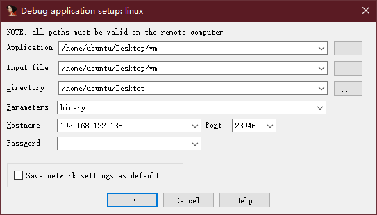

# IDA---远程调试linux程序

将dbgsrv文件夹中相应的服务程序复制到远程机器中并启动  
以管理员启动IDA，设置远程调试的ip和port，开启进程或者附加进程，就能开始调试了  
Process options设置：  
  

需要注意使用匹配的版本运行，32位就都选32位，64同理  
举例：  
一个64位的系统安装了32位运行库，可以运行32位程序，选择linux_server复制到远程机器，本地用管理员打开IDA32，这样选择远程调试，就能正常调试了  

小技巧：  
1. 先运行起来，然后中止，这个时候就能把远程机器的程序load到IDA，下断点什么的就很方便了
2. 把远程机器的ip设置为静态ip，这样就不用频繁更改调试远程机器的地址了

2020/3/24  
