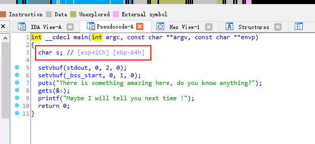
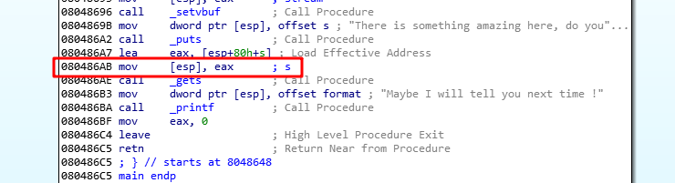

# IDA的分析---局部变量的ebp偏移不准确

IDA上显示 s相对于 ebp的位置是 `[ebp-64h]`：  
  
但是实际调试之后发现这个位置有误差，应该是`[ebp-6ch]`  

问题就是IDA分析出的 s 相对于 ebp 的位置是不准的  

看一下汇编：  
  
操作是相对于esp的，所以需要动态调试确定偏移  
```
FFFFD2EC  F7DECE81  libc_2.27.so:__libc_start_main+F1
FFFFD27C
```
偏移为0x70  


2017/12/28  
