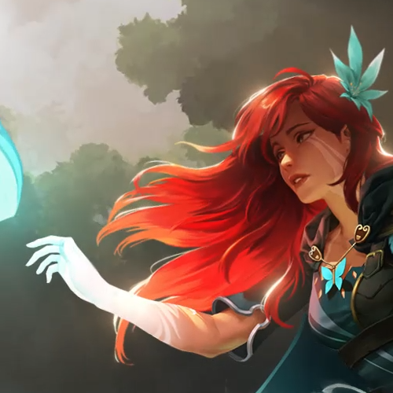

# ImageMagick---图片分割合并

ImageMagick可以对图像进行各种操作，创建、编辑、合成、转换等。  
官网: https://imagemagick.org  

这里写一下图片的分割与合并。  
```r
# 分割图片，得到chip-0.png/chip-1.png/chip-2.png/chip-3.png
convert -crop 250x250 windranger.png chip.png

# 合并图片，每张图片250x250大小，图片之间宽间距2高间距4(如果不需要间距都设置为0)
# 如果碰到顺序乱序的拼图，可以尝试合并图片后使用gaps自动拼图
montage -geometry 250x250+2+4 chip-*.png result.png
```

windranger.png  
  

result.png  
  


2022/1/13  
