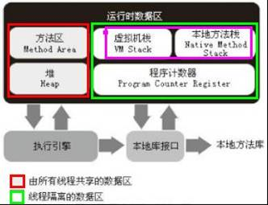

# JVM内存模型以及各区域功能

  

`程序计数器（Program Counter Register）`：可看作是当前线程所执行的字节码的行号指示器，线程私有  
`虚拟机栈（VM Stack）`：存放基本数据类型，为虚拟机执行Java方法（字节码）服务，线程私有，可能有StackOverflowError异常和OutofMemoryError异常  
`本地方法栈（Native Method Stack）`：为虚拟机使用到的Native方法服务，可能有StackOverflowError异常和OutofMemoryError异常  
`堆（Heap）`：被所有线程共享，存放对象实例，是垃圾收集器管理的主要区域，可能有OutofMemoryError异常  
`方法区（Method Area）`：所有线程共享，存储被虚拟机加载的类信息、变量、静态变量、即时编译器编译后的代码等数据  

2017/9/19  
