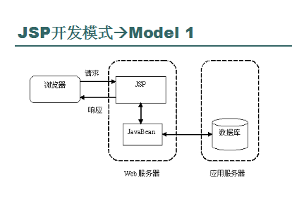
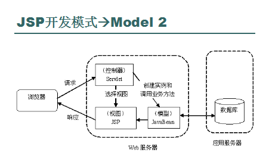
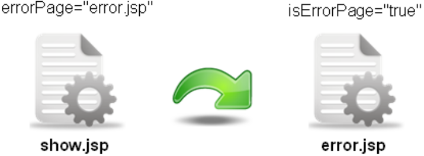
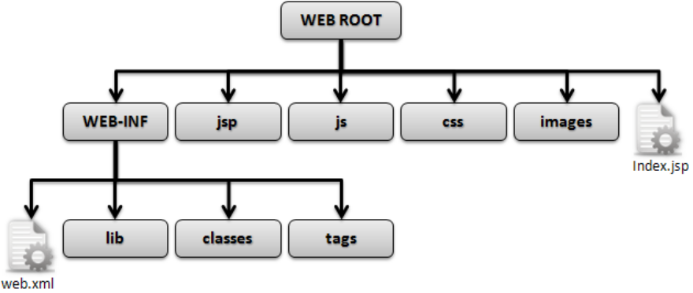

# Java-EE简单复习

## Tomcat主要目录及作用
Bin：所有的可执行命令，启动和关闭服务器的命令就在此文件夹之中  
Conf：服务器的配置文件夹，里面保存了各个配置信息  
Lib：Tomcat服务器所需要的各个库文件  
Logs：保存服务器的系统日志  
Webapps：web应用程序存放的目录，web项目保存到此目录中即可发布  
Work：临时文件夹，生成所有的临时文件（*.java、*.class）  

## Servlet
概念：  
是使用java语言编写的服务器端程序，可以像jsp一样生成动态的Web网页；主要运行在服务器端，并由服务器调用执行，是一种按照servlet标准开发的类  
 
处理基本流程：  
1. 客户端（很可能是web浏览器）通过HTTP提出请求
2. Web服务器接受该请求并将其发送给servlet。如果此servlet尚未被加载，web服务器将把它加载到java虚拟机并且执行它
3. Servlet程序将接收该HTTP请求并执行某种处理
4. Servlet会将处理后的结果想web服务器返回应答
5. Web服务器将从servlet收到的应答发回给客户端
 
生命周期：  
加载程序、初始化、服务、销毁、卸载  
 
生命周期对应的操作方法：  
加载：web容器启动或者第一次使用此servlet时，加载并通过反射的方式对servlet进行实例化  
初始化：容器调用init()方法初始化此对象，目的是让servlet对象在处理客户端请求前完成一些初始化的工作  
处理服务：有请求提交时，servlet调用service()方法(常用doGet()或doPost())，接收请求或设置响应信息  
销毁：Web容器关闭或检测到servlet要从容器中被删除时，自动调用destroy()方法，释放该实例占用的资源  
卸载：等待被垃圾收集器回收  

## HTML表单
```html
<form name="form1" method="post" action="loginAction.jsp">
	用户名：<input type="text" name="name">
	密码：<input type="password" name="pwd">
	<input type="submit" name="Submit" value="提交">
</form>
```

## get，post方式区别
get：将表单内容经过编码之后，通过url发送，发送时有255个字符的限制，可以在地址栏看到  
post：将表单的内容通过http发送，没有字符长度的限制，在地址栏看不到表单的提交信息  

## web.xml基本元素
```xml
<servlet>
	<servlet-name>HelloWorldServlet</servlet-name>    为了方便使用servlet，取别名
	<servlet-class>HelloWorldServlet</servlet-class>    完整的包名+类名
</servlet>

<servlet-mapping>
	<servlet-name>HelloWorldServlet</servlet-name>
	<url-pattern>HelloWorldServlet</url-pattern>    访问Servlet的URL
</servlet-mapping>
```

## 简单cookie，application，session特点
cookie：保存在客户端的文本文件  
session：保存在服务器端的信息，最主要用处是完成用户的登陆、注销  
application：用于保存整个WebApplication的生命周期内都可以访问的数据  

## JSP
概念：  
在传统的HTML网页文档中加入能够生成动态内容的可执行java程序片段和jsp标记所构成的代码  

原理：  
jsp程序  转化->servlet程序  编译->java字节码  驻留->以Servlet形式存在  

三种脚本程序写法及作用  
1. `<% ... %>` java代码
2. `<%! ... %>` 声明变量或方法
3. `<%= ... %>` 表达式，求出值后显示

注释：  
1. `<!--Hello-->`  XHTML注释
2. `<%--Hello--%>` JSP隐式注释
3. `//` java行末隐式注释
4. `/* */` java多行隐式注释

四种属性操作范围  
pageContext：（页面的管理属性）只在一个页面中保存属性，跳转之后无效  
request：（包含客户端的请求）只在一次请求中保存，服务器跳转之后依然有效  
session：（代表JSP与客户端的对话）在一次会话范围内，无论何种跳转都可以使用，但是新开浏览器无法使用  
application：（代表一个执行JSP的容器）在整个服务器上保存，所有用户都可以使用  

四种属性操作方法（pageContext举例）（很少的部分）  
pageContext.setAttribute（String name，Object o）  设置属性的名称及内容  
pageContext.getAttribute（String name）  根据属性名称取得属性  
pageContext.removeAttribute（String name）  删除指定的属性  

## JSP跳转及Servlet跳转的语法
JSP跳转：  
1. 不传递参数  
   ```jsp
    <jsp:forward page="{要包含的文件路径 | <%=表达式%>}"/>
   ```
2. 传递参数  
   ```jsp
    <jsp:forward page="{要包含的文件路径 | <%=表达式%>}">
        <jsp:param name="参数名称" value="参数内容"/>
        ... 可以向被包含页面中传递多个参数
    </jsp:forward>
   ```

Servlet跳转：  
客户端：`resp.sendRedirect("get_info.jsp")`  
服务器端：`RequestDispatcher rd = req.getRequestDispatcher("get_info.jsp"); rd.forward(req, resp);`  

## 客户端及服务端跳转区别
服务端：可以传递request范围的属性，不改变地址栏
客户端：无法传递request范围的属性，地址栏改变

## 两种开发模式
Mode I  
在开发中将显示层、控制层、数据层的操作统一交给JSP或者是JavaBean来进行处理  
  

Mode II（Model-View-Controller）  
所有开发以Servlet为主体，由Servlet接收所有的客户端请求，之后根据请求调用相应的JavaBean，并将所有的显示结果交给JSP完成，也就是俗称的MVC设计模式。  
  

## 两种包含
静态包含：  
```jsp
<%@include file="要包含的文件路径"%>
```
动态包含：  
1. 不传递参数  
   ```html
    <jsp:include page="{要包含的文件路径|<%=表达式%>}" flush="true|false"/>
   ```
2. 传递参数  
   ```html
   <jsp:include page="{要包含的文件路径|<%=表达式%>}" flush="true|false">
        <jsp:param name ="参数名称" value="参数内容"/>
        可以向被包含页面中传递多个参数
    </jsp:include>
   ```

两种包含区别  
静态包含：属于先包含后处理  
动态包含：如果包含的是动态页，则先分别处理后再将处理的结果包含进来  

## 五种内置对象
request 包含客户端的请求，是一个实现了HttpServletRequest接口的对象，有十几个方法成员，交互中常用。  
response 对客户端的响应，向客户发数据，是一个实现了HttpServletResponse接口的对象。  
session 代表JSP与客户端的对话，是javax.servlet.http.HttpSession对象。  
application 代表一个执行JSP的容器，是javax.servlet.ServletContext类的对象实例。  
out 传送相应的输出流，是javax.servlet.jsp.JspWriter对象  

## 错误页设置
两个条件：  
1. 指定错误出现时的跳转页，通过errorPage属性指定  
    `<%@page errorPage="error.jsp"%>`
2. 错误处理页必须有明确的标识，通过isErrorPage属性指定  
    `<%@page isErrorPage="true"%>`
  

## JDBC
JDBC, Java DataBase Connectivity, 是一种可用于执行SQL语句指令的Java API，由一些java语言写的类和接口组成。  

## 查询数据库范例
```java
private Connection connect;
private Statement stmt;
private ResultSet results;

try{
	//第一步：载入JDBC驱动程序
	Class.forName( driver );
	//第二步：连接到数据库
	Connection connect = DriverManager. getConnection( url, user, password );
	//第三步：创建Statement对象
	stmt = connect.createStatement();
	//获取查询结果
	String query = "SELECT * FROM namelist";
	results = stmt.executeQuery( query );
	//第四步：处理查询结果
	StringBuffer s = new StringBuffer();
	//获取数据描述信息
	ResultSetMetaData metaData = results.getMetaData();
	int columns = metaData.getColumnCount();
	//输出数据表列名
	for ( int i = 1; i <= columns; i++ )
		s.append( metaData.getColumnName( i ) + "    " );
	s.append( "\n" );
	//输出数据记录
	while ( results.next() )
	{
		for ( int i = 1; i <= columns; i++ )
			s.append( "   " + results.getObject( i ) );
		s.append( "\n" );
	}
	area.append( s.toString() );
}
catch ( SQLException sqlException )
{
	area.append( "发生SQLException异常\n" );
}
catch ( ClassNotFoundException classNotFound )
{
	area.append( "发生ClassNotFoundException异常\n" );
}
finally{
	try{
//第五步：终止与DBMS的连接
		results.close();
		stmt.close();
		connect.close();
	}
	catch ( SQLException sqlException )
	{
		sqlException.printStackTrace();
	}
	catch ( NullPointerException nullpointerException )
	{
		nullpointerException.printStackTrace();
	}
}
```

## JavaBean
概念：javaBean是java类，在遵循javabean特定规范下对功能进行封装，并提供可以访问的方法接口，从而使开发者可以调用其内部已有的功能，实现了代码的重用  

优点：  
1. 将HTML和java代码分离，方便维护
2. 常用的程序写成javaBean组件，不用重复写相同的程序，节省开发所需时间

开发要求：
1. 所有类必须放在一个包中
2. 所有类必须声明为public class，这样才能够被外部所访问
3. 所有属性都必须封装，即使用private声明
4. 封装的属性如果需要被外部所操作，则必须编写对应的setter，getter方法
5. 一个javabean中至少存在一个无参构造方法，此为jsp中的标签使用

```html
<jsp:useBean>
<jsp:useBean id="simple" scope="page" class="cn.mldn.lxh.demo.SimpleBean"/>
<jsp:setProperty>
<jsp:setProperty name="simple" property="name" value="李兴华"/>
<jsp:getProperty>
<h3>姓名：<jsp:getProperty name="simple" property="name"/></h3>
```

## WEB开发标准目录结构
Web Application放在Tomcat中的位置及主要的目录结构（WEB开发的标准目录结构）  
  


---
2016/11/11  
