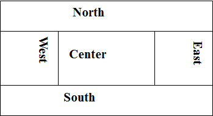

# Java复习

## 第1章
1. 简单、面向对象、分布式、解释执行、鲁棒、安全、体系结构中立、可移植、高性能、多线程以及动态性的编程语言  
2. 驼峰式命名规则：多个单词首尾相连，中间单词的首字母一般为大写  
    方法名：第一个单词通常为动词  
    变量名：全小写名词  
    常量名：全大写  

## 第2章
1. java标识符 大小写敏感  
2. 一些类型  
    整型 默认 int  
    浮点型 默认 double  
    字符串 双引号括起  
    字符 单引号括起  

## 第3章
1. public 表示公有类，要求该类所在文件名与此类名相同，一个程序文件中最多包含一个公有类  
2. 构造方法  
    ①构造方法必须具备和所在类相同的名字  
    ②构造方法没有返回类型，没有void  
    ③构造方法是在创建一个对象使用new操作符时调用的，构造方法的作用是初始化对象  
3. 堆（heap） 一般用于存放所有的Java对象，即用new产生的数据
4. 成员初始化次序：在类的内部，最先初始化静态（static）成员，静态成员只在第一次访问时初始化一次。变量定义的先后顺序决定了初始化的顺序。即使变量定义散布于方法定义之间，它们仍然会在任何方法被调用之前得到初始化
5. package语句：指明该文件中定义的类存放到哪个包中
6. 要想导入某个包中所有的类，可以使用通配符 *  如: `import java.util.*;` 最好不要这么做

## 第4章
1. 继承重写比喻  
    继承---->遗传  
    重写---->变异  
2. 必须在构造方法的第一条语句就用super来调用超类中的构造方法，只有这样才能保证在实际使用类之前完成构造方法的执行
3. 方法重载：在一个类中，多个方法的方法名相同，但是参数列表不同  
    方法重载是让类以统一的方式处理不同类型数据的一种手段  
    重载方法必须具有不同的参数列表  
4. this和super变量  
    this变量出现在一个方法成员的内部，指向当前对象。当前对象指的是调用当前正在执行方法的那个对象  
    super变量直接指向超类的引用，用来引用超类中的变量和方法  
5. 接口名 尽量用 ....able, 接口没有构造方法  
6. 内部类是外部类的一个成员

## 第6章
子类父类异常：先捕获子类异常，catch 子类放前面  

## 第7章
1. 动态初始化: `int a[]=new int[100]`
2. ArrayList 对于不指定参数的构造方法，系统默认其容量为10, 指定容量: `ArrayList a=new ArrayList(20);`  
3. 泛型示例: `List<String> a=new ArrayList<String>();`
4. Set不允许保存相同值的元素
5. HashSet 的速度是最快的

## 第9章
1. 每个进程必须包括至少一个线程，进程中创建的第一个线程称为主线程
2. 所有的引用类型的示例都存放在堆区，而局部（local）变量都存放在栈区

## bit操作符
位操作符 `&, |, ^, ~（非）`  
移位操作符 `>>, <<, >>>（无符号右移）`  

## 变量堆栈位置
基本类型赋的值在栈（stack）里，引用类型值在堆（heap）里  

## 带label的break
带label的break语句的用法的作用是跳出label所标定的块  

## 类对象
```java
class ATypeName {/*类主体置于这里*/}
ATypeName a = new ATypeName();
```

## 类,方法，对象
在Java中，方法只能作为类的一部分来创建，方法只有通过对象才能调用，且这个对象必须能够执行这个方法调用

## 成员初始化次序
1. 最先初始化 statics 成员, 静态成员只在第一次访问时初始化一次
2. 在类的内部，变量定义的先后顺序决定了初始化的顺序。即使变量定义散布于方法定义之间，它们仍旧会在任何方法被调用之前得到初始化

## Package语句 
package语句放在Java源程序文件的第一行，指明该文件中定义的类存放到哪个包中。  
程序中可以没有package语句，此时类将存放到默认包中。  
```java
package  pkg1.[pkg2.[pkg3.…]]；      
package access.mypackage; 
```

显然package语句最多只能有一条。 描述包的字符都用小写。  

## 抽象类和接口
抽象类是部分抽象的，接口是纯抽象的  

## 内部类
1. 内部类的class 文件名是由外部类的类名与内部类的类名用 `$` 连起来形成的，如 `OutClassName$InnerClassName.class`
2. 匿名内部类的类名为 `OutClassName$#.class`，其中的 `$` 为数字，从1开始，每生成一个匿名内部类，数字递增1

## 边界布局
BorderLayout是JFramd的默认布局  
BorderLayout将组件分置五个区域：北、南、东、西、中  
  

## throws和throw
1. throws 关键字是在方法声明时放在方法头中的，作用是声明一个方法可能抛出的所有异常；
2. throw 关键字则出现在方法体的内部，是一个具体的执行动作，作用是抛出一个具体异常对象。

## 静态初始化和动态初始化
静态初始化  
```java
int a[]={21,34,7,8,10};  //a.length=5
int[] a = new int[] {1, 2, 3, 4};
```
动态初始化  
```java
int[] a = new int[10];  //a.length=10
```
动态初始化可以使用变量作为参数：  
```java
int a[] = new int[len];  //len是一个变量
```

## Collection
接口Collection（类集）: 一组单独元素集合  
List：保存的对象有顺序，按照元素的索引位置检索对象。允许重复元素。  
Set：不允许保存重复的元素。元素之间没有顺序。靠元素值检索对象。  
接口Map<K,V>（映射）: 一组键值对  
元素包括“键”对象和“值”对象。键必须是唯一的，值可以重复。  

Collection接口都可以使用迭代器  
```java
List<String> a = new ArrayList<String>();
for(Iterator<String> it= a.iterator(); it.hasNext(); ) { 
  String s = it.next(); //取出元素
}
```

## HashSet,TreeSet,LinkedHashSet
```
第 0 次随机数产生为：46
第 1 次随机数产生为：0
第 2 次随机数产生为：27
第 3 次随机数产生为：70
第 4 次随机数产生为：61

HashSet：[0, 70, 27, 46, 61]
LinkedHashSet：[46, 0, 27, 70, 61]
TreeSet：[0, 27, 46, 61, 70]

- HashSet的元素存放无顺序
- LinkedHashSet保持元素的添加顺序
- TreeSet元素按值进行排序存放
```

## Map遍历
一个Map中不能包含相同的key，每个key只能映射一个value。  

Map遍历三种方法  
方法一：遍历值  
```java
publicvoidbyValue(Map<String,Student>  map) {
    Collection<Student> c = map.values();
    Iterator it;
    for (it=c.iterator(); it.hasNext();){
        Student s = (Student)it.next();
    }
}
```

方法二：通过键遍历值  
```java
publicvoidbyKey (Map<String, Student> map) {
    Set<String> key = map.keySet();
    Iterator it;
    for (it = key.iterator(); it.hasNext();) {
        String s = (String) it.next();
        Student value = map.get(s);
    }
}
```

方法三：Map.Entry:Map内部定义的一个接口，专门用来保存键值对的内容  
```java
publicstaticvoidbyEntry(Map<String, Student> map) {
    Set<Map.Entry<String, Student>> set = map.entrySet();
    Iterator<Map.Entry<String, Student>> it;
    for (it= set.iterator(); it.hasNext();) {
        Map.Entry<String, Student> entry = it.next();
        System.out.println(entry.getKey() + "--->" + entry.getValue());
    }
}
```

## 创建线程方法

方法一：实现 Runnable接口  
```java
class PrimeRun implements Runnable {
    long minPrime;
    PrimeRun(long minPrime) {
        this.minPrime = minPrime;
    }

    public void run() {
        // compute primes larger than minPrime
        ...
    }
}
```
方法二：继承Thread类  
```java
class PrimeThread extends Thread {
    long minPrime;
    PrimeThread(long minPrime) {
        this.minPrime = minPrime;
    }
    public void run() {
        // compute primes larger than minPrime
        ...
    }
}
```

## 线程同步方法
方法一  
```java
synchronized ReturnType  methodName(parameterList){
  method statement;
}
```

方法二  
```java
synchronized (object){
  statement;
}
```

## 线程间协作
```java
public void put(Object x) throws InterruptedException {
    synchronized (lock) {  //需同步方法一
            while (count == items.length)
                lock.wait();    //等待take线程取走数据
        items[putptr] = x;
        if (++putptr == items.length)
            putptr = 0;
        ++count;
        synchronized (emptyLock) {
            emptyLock.notify(); //通知take线程
        }
    }
}

public Object take() throws InterruptedException {
    synchronized (lock) {  //需同步方法二
        while (count == 0){
            synchronized (emptyLock) {  //如果为空，等待
                emptyLock.wait();
            }
        }
        Object x = items[takeptr];
        if (++takeptr == items.length)
            takeptr = 0;
        --count;
        lock.notify();  //通知put线程
        return x;
    }
}
```

## 扩展锁机制
```java
class SimpleLock {
    private final ReentrantLock lock = new ReentrantLock();  //①
    public void doSth() {
        lock.lock();  //②
        try {
        // statement
        } finally {  //③
            lock.unlock()  //④
        }
    }
}

public void put(Object x) {
    lock.lock();
    try {
        while (count == items.length)
            notFull.await();
        items[putptr] = x;
        if (++putptr == items.length) putptr = 0;
        ++count;
        notEmpty.signal();
    } finally {
        lock.unlock();
    }
}

public Object take() {
    lock.lock();
    try {
        while (count == 0)
            notEmpty.await();
        Object x = items[takeptr];
        if (++takeptr == items.length)
            takeptr = 0;
        --count;
        notFull.signal();
        return x;
    } finally {
        lock.unlock();
    }
}
```

## 常用SQL句型
### 数据表创建  
```sql
create table <表名> (字段1 类型1(长度),字段2 类型2(长度) …… )
```
[例] 创建学生数据表students，包含学号，姓名，性别，生日和系名信息。  
```sql
create table students
    (snovarchar(10), name varchar(20), sex varchar(5),
        birthday datetime,  department varchar(50))
```
### 删除数据表
```sql
drop table <表名>
```
[例] 删除数据表students。
```sql
drop table students
```
### 查询语句
```sql
select <输出结果列表> from <表>
[where <选择条件>]
[order by <排序条件>]
[group by <分组条件>]
```
[例] 查询所有同学的学号和姓名。
```sql
select sno, name from students
```
[例] 按照年龄从大到小的次序列出男同学的学号和姓名。
```sql
select sno, name from students
    where sex='男'
    order by birthday
```
[例] 查询姓“赵”的同学的姓名、所属院系和出生年月日。
```sql
select name, department, birthday from students
    where name like '赵%'
```
### 插入语句
```sql
insert into <表名> [(<列表名>)]
VALUES(<对应列的值表>)
```
[例] 把一位学号为S200、姓名为何十、性别为男、出生年月日为1993年11月19日法学院学生的记录插入到表students中。
```sql
insert into students
(sno, name, sex, birthday, department)
values('S200','何十','男','1993/11/19','法学院')
```
### 修改语句
```sql
update <表名> set <列>=<值>[,<列>=<值>][where <定位条件>]
```
[例] 把学号为S200的学生从法学院调到信息学院。
```sql
update students
set department='信息学院'
where sno='S200'
```
### 删除语句
```sql
delete from <表名> [where <条件>]
```
[例] 把学号为S200的学生记录删除。
```sql
delete from students
where sno='S200'
```

## JDBC编程步骤
```
导入java.sql.*包：import  
① 加载JDBC驱动程序：Class.forName()
② 定义数据库的URL：String url="jdbc:derby:helloDB"
连接数据库：getConnection(url)
③ 建立SQL语句对象：createStatement()
执行SQL语句：executeQuery() 、execute() 、executeUpdate()
④ 处理结果集：next()、 previous()……
⑤ 关闭连接：commit()、 close()
```

## TCP和UDP
TCP是面向连接的、可靠的协议；UDP是面向非连接、不可靠的连接。  

## 网络连接5元组
一个网络连接是一个5元组：  
协议名称，本地地址，本地端口，远程地址，远程端口  
通过端口确定通信进程，端口取值范围0~65535，其中0~1023为系统保留端口。  

## 程序,进程,线程
程序是静态的  
进程是程序的一次动态执行过程  
一个进程在执行过程中可以产生多个线程  

## 按行读数据
BufferReader类的readLine()  
每次读取一行数据  
可能抛出IOException异常，调用该方法时通常应将它放在try块中，并通过catch块处理异常  
如果读到流的末尾，该方法返回的结果为null（可据此判断文件是否读完）  

## 向上转型
通俗理解，就是子类转型成父类。  
```java
class A{}
class B extends A{}
A b=new B();
```

## newInstance和new
Class下的newInstance()和new有什么区别？  
首先，newInstance()是一个方法，而new是一个关键字，  
其次，Class下的newInstance()的使用有局限，因为它生成对象只能调用无参的构造函数，而使用 new关键字生成对象没有这个限制。  
   
Class.forName("")返回的是类  
Class.forName("").newInstance()返回的是object  

原链接: https://www.cnblogs.com/shosky/archive/2011/07/22/2114290.html  

## Equals和==
java中的数据类型，可分为两类：  
1.基本数据类型，也称原始数据类型。byte,short,char,int,long,float,double,boolean   他们之间的比较，应用双等号（==）,比较的是他们的值。  
2. 复合数据类型(类)，当他们用（==）进行比较的时候，比较的是他们在内存中的存放地址，所以，除非是同一个new出来的对象，他们比较后的结果为true，否则比较后结果为false。JAVA当中所有的类都是继承于Object这个基类的，在Object中的基类中定义了一个equals的方法，这个方法的初始行为是比较对象的内存地址，但在一些类库当中这个方法被覆盖掉了，如String,Integer,Date在这些类当中equals有其自身的实现，而不再是比较类在堆内存中的存放地址了。  

## 线程应用实例
```java
public class Pass implements Runnable{
    private Object lock=new Object();
    public void run(){
        synchronized(lock){
            System.out.println(Thread.currentThread().getName());
            try{
                Thread.sleep(1000);
            }catch(InterruptedException e){
                e.printStackTrace();
            }
        }
    }

    public static void main(String[] args){
        Pass p=new Pass();
        new Thread(p,"ONE").start();
        new Thread(p,"TWO").start();
        new Thread(p,"THREE").start();
        new Thread(p,"FOUR").start();
        new Thread(p,"FIVE").start();
        new Thread(p,"SIX").start();
        new Thread(p,"SEVEN").start();
        new Thread(p,"EIGHT").start();
    }
}
```

---
2016/5/31  
