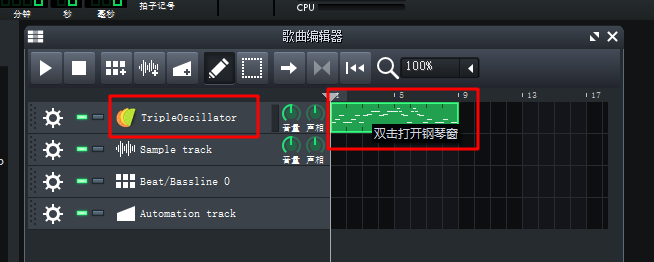
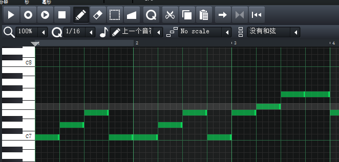

# LMMS---简单介绍

官网：https://lmms.io  

LMMS, Linux MultiMedia Studio, 免费自由开源并且跨平台的作曲工具。  
虽然名字有Linux，实际上支持Linux、Windows、Mac。  

新建一个项目，在 TripleOscillator 后面双击，就能打开钢琴窗  
  

然后可以愉快填一下 两只老虎  
  

最后导出为mp3，有意思  

b站教程：https://www.bilibili.com/video/BV1W5411x7oS  

2020/7/4  
