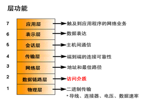
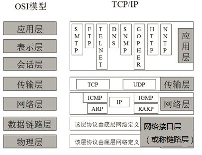

# OSI-TCP/IP

## OSI模型
OSI model, Open System Interconnection Reference Model, 开放式系统互联通信参考模型  

七层：  
| 中文       | 英文               | 传输单位      |
| ---------- | ------------------ | ------------- |
| 应用层     | Application Layer  |               |
| 表示层     | Persentation Layer |               |
| 会话层     | Session Layer      |               |
| 传输层     | Transport Layer    | 报文(message) |
| 网络层     | Network Layer      | 分组(packet)  |
| 数据链路层 | Data-Link Layer    | 帧(frame)     |
| 物理层     | Physical Layer     | 比特(bit)     |
apstndp  

OSI层功能  
  


## TCP/IP模型

TCP/IP, Transmission Control Protocol/Internet Protocol，传输控制协议/网际协议  

四层：  
```
应用层
传输层
网络层
网络接口层（或称链路层）
```


## OSI-TCP/IP对照和相关协议
  


2017/9/18  
