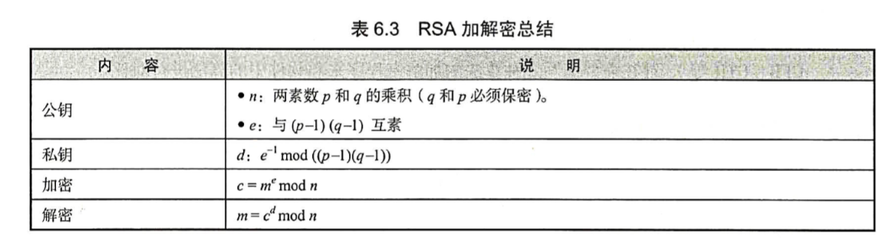

# RSA要点总结

## 文字版
**公钥**  
n: 两素数 p 和 q 的乘积(p 和 q 必须保密)  
e: 与 (p-1)(q-1) 互素  

**私钥**  
d: $e^{-1}  \mod (p-1)(q-1)$  
也就是 $d*e \equiv 1 \mod (p-1)(q-1)$  

**加密**  
$c \equiv m^e \mod n$  

**解密**  
$e \equiv c^d \mod n$  

## 图片版
  

2020/1/11  
