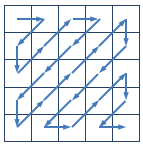

# Z字形扫描

  
```
问题描述 
　　在图像编码的算法中，需要将一个给定的方形矩阵进行Z字形扫描(Zigzag Scan)。给定一个n×n的矩阵，Z字形扫描的过程如上图所示：

　　对于下面的4×4的矩阵，
　　1 5 3 9
　　3 7 5 6
　　9 4 6 4
　　7 3 1 3
　　对其进行Z字形扫描后得到长度为16的序列：
　　1 5 3 9 7 3 9 5 4 7 3 6 6 4 1 3
　　请实现一个Z字形扫描的程序，给定一个n×n的矩阵，输出对这个矩阵进行Z字形扫描的结果。
输入格式
　　输入的第一行包含一个整数n，表示矩阵的大小。
　　输入的第二行到第n+1行每行包含n个正整数，由空格分隔，表示给定的矩阵。
输出格式
　　输出一行，包含n×n个整数，由空格分隔，表示输入的矩阵经过Z字形扫描后的结果。
样例输入
4
1 5 3 9
3 7 5 6
9 4 6 4
7 3 1 3
样例输出
1 5 3 9 7 3 9 5 4 7 3 6 6 4 1 3
评测用例规模与约定
　　1≤n≤500，矩阵元素为不超过1000的正整数。
```

代码及分析如下  
```cpp
/*此程序需要对边界情况做好精确处理，分类情况较多，情况的层次较难把握 */

#include "iostream"
using namespace std;

int main()
{
    int a[500][500];
    int n;
    cin>>n;
    int i,j;
    for(i=0;i<n;i++)
    {
        for(j=0;j<n;j++)
        {
            cin>>a[i][j];
        }
    }
    i=0;j=0;
    int p=1;
    int k;
    while(i!=n-1||j!=n-1)
    {
        while(p)  //负责上行 即往右上方向的输出 
        {
            if(i!=0&&j!=n-1)                  //正常处理 
            {cout<<a[i][j]<<" ";i--;j++;}
            else if(j==n-1)                   //负责右下三角最右方处理 
            {cout<<a[i][j]<<" ";i++;k=1;p=0;}
            else if(i==0)                     //负责左上三角最上方处理 
            {cout<<a[i][j]<<" ";j++;k=1;p=0;}

        }
        while(k)   //负责下行 即往左下方向的输出 
        {
            if(i!=n-1&&j!=0)                  //正常处理 
            {cout<<a[i][j]<<" ";i++;j--;}
            else if(i==n-1)                   //负责右下三角最下方处理 
            {cout<<a[i][j]<<" ";j++;p=1;k=0;}
            else if(j==0)                     //负责左上三角最左方处理 
            {cout<<a[i][j]<<" ";i++;p=1;k=0;}
        }
    }
    cout<<a[i][j];     //右下角数据输出 
    return 0;
}
```


2016/4/7  
