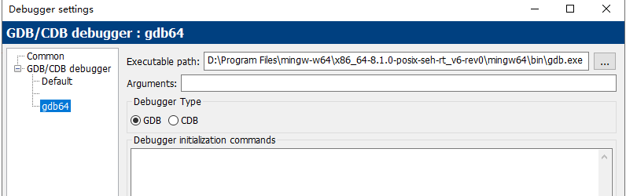
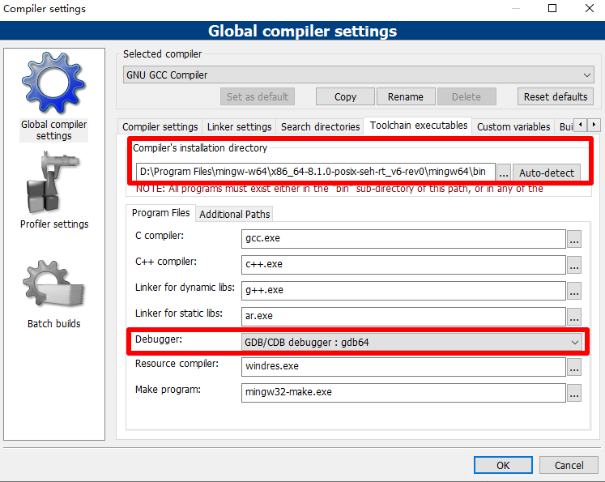

# codeblocks---设置编译64位程序

下载64位版本的mingw并安装  
https://sourceforge.net/projects/mingw-w64/  

Settings->Debugger->GDB/CDB debugger->Create Config  
设置Executable path  
  

Settings->Compiler->Global compiler settings->Toolchain executables  
修改Compiler's installation directory 和 Debugger  
  

参考：https://blog.csdn.net/c_C2233/article/details/77796782  

2019/1/14  
