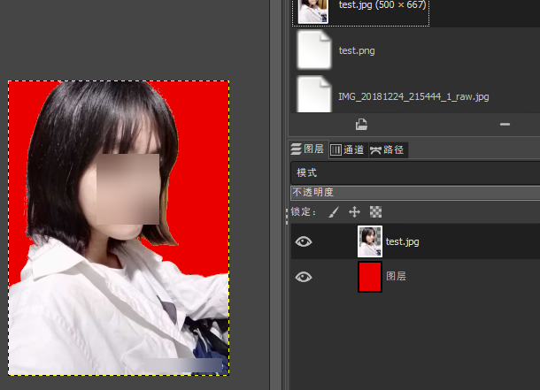

# gimp---图片改背景为白色

keywrods: gimp 抠图 背景透明  

导入图片

长得像魔棒的图标，长按左键选择"模糊选择"，选一下背景，大部分就选好了，也可以放大细节多按几次  
长得像套索的图标，长按左键选择"自由选择"，改一下一些小地方的不合理选区，这里比较重要的是左边的模式："合并"/"减去"/"相交"，合理地切换，就会很简单。  

接着按"Delete"，就能得到一张背景是白色的照片了。  

最后按自己需要的格式和大小导出就好了。  

透明背景：  
在背景选区，右键，颜色->颜色到透明->确定，即可，有时候别的地方也变透明了，就把阈值改一下  

这里改成透明以后，加了红色图层，哈哈  

  

2020/6/20  
