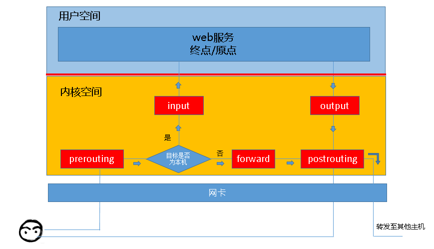

# iptables笔记

## iptables和netfilter
iptables，用户空间，操作netfilter实现防火墙功能  
netfilter，内核空间，网络地址转换、数据包操作  

## 链
```r
INPUT           输入
OUTPUT          输出
PREROUTING      路由前
FORWARD         转发
POSTROUTING     路由后
```
链之间的关系：  
  

## 表
```r
filter  过滤
nat     network address translation，网络地址转换
mangle  拆解修改并重新封装报文
raw     跳过NAT，关闭链接追踪，提高效率
```

## 同一条链上表中规则的执行优先级
raw --> mangle --> nat --> filter  

## 规则构成
匹配条件，处理动作  

匹配条件有：ip，端口等  

处理动作有：  
```r
ACCEPT      允许通过
DROP        丢弃，没有回应信息
REJECT      拒绝通过，发送拒绝的信息
SNAT        源地址转换，解决用户共用公网ip上网问题
MASQUERADE  SNAT的特殊形式，适用于动态的、临时会变的ip上(单词含义：冒充，模仿)
DNAT        目标地址转换
REDIRECT    重定向，在本机做端口映射
LOG         记录日志信息到/var/log/messages文件中，将数据包传递给下一条规则
```

处理动作如果是扩展动作，可以跟选项，如 `REJECT` 可以通过 `--reject-with` 选项设置回应的提示信息  

## 查看filter表的规则
```r
iptables -t filter -L INPUT -v
# -t选项指定要操作的表，如果省略-t选项，默认操作filter表
# -L选项表示列出规则，后面可以跟指定的链，如果没有指定的链，则列出所有链
# -v选项表示列出详细内容
```

## 一条规则相应字段的含义
```r
pkts        对应规则匹配到的报文的个数
bytes       对应匹配到的报文包的大小总和
target      规则的处理动作，即规则匹配成功后需要采取的措施
prot        协议，是否只针对某些协议应用此规则
opt         规则对应的选项
in          数据包从哪个接口(网卡)流入
out         数据包从哪个接口(网卡)流出
source      规则对应的源地址，可以是ip或网段
destination 规则对应的目的地址，可以是ip或网段
```

## 查看规则其他可能常用的选项
```r
-n              规则的source和destination显示为ip，不进行解析，在规则较多时可以节省时间
--line-numbers  显示规则的编号，如果有该选项，规则会多一个num字段，可简写为 --line
```

## 查看规则时一个链的总结信息显示含义
举例(使用-v选项时才会显示packets和bytes)：   
```r
Chain INPUT (policy ACCEPT 104K packets, 1964M bytes)
# policy后跟的是该链的默认动作，这里的默认动作为ACCEPT
# packets前的数表示当前链默认策略匹配到的包的数量
# bytes前的数表示当前链默认策略匹配到的包的大小总和
# 默认情况下packets和bytes数值过大时会显示为可读性较强的形式，可以用-x选项显示精确数值
```

## 插入规则：丢弃源ip为192.168.64.1的报文
```r
iptables -t filter -I INPUT -s 192.168.64.1 -j DROP
# -I insert，指明将规则插入哪条链中
# -s source，指明"匹配条件"中的"源地址"
# -j 匹配规则后指定的动作
```

## 添加规则：接受源ip为192.168.64.1的报文
```r
iptables -t filter -A INPUT -s 192.168.64.1 -j ACCEPT
# -A append，向指定的链追加规则，和-I的区别：-A添加到链的尾部，-I插入到链的首部
```

## 添加规则时指定规则编号
```r
iptables -t filter -I INPUT 2 -s 192.168.64.123 -j ACCEPT
# 向filter表的INPUT链中添加一条编号为2的规则，原来的规则编号依次后移
# 1234-->12345，原来的234号规则变为345号规则
```

## 规则匹配机制
从前向后匹配，有规则匹配成功，则执行相应的动作，根据动作决定是否继续匹配后面的规则


## 删除规则的方式
1. 根据规则编号删除  
```r
iptables -t filter -D INPUT 2
# 删除filter表的INPUT链中编号为2的规则
```
2. 根据具体的匹配条件和动作删除  
```r
iptables -t filter -D INPUT -s 192.168.64.1 -j ACCEPT
# 删除满足匹配条件和动作的第一条规则
```

## 删除filter表的INPUT链的所有规则
```r
iptables -t filter -F INPUT
# -F flush，冲刷，即删除，如果不指定链名，会删除该表的所有规则
```

## 替换指定规则
```r
iptables -t filter -R INPUT 2 -s 192.168.64.1 -j REJECT
# -R replace，此处为替换filter表的INPUT链编号为2的规则
```

## 设置指定表链的默认策略
```r
iptables -t filter -P INPUT DROP
# 将filter表的INPUT链的默认策略设置为DROP
```

## 将规则保存到文件
```r
iptables-save > rules.save
```

## 将文件中存储的规则恢复
```r
iptables-restore < rules.save
```

## 规则的基本匹配条件示例
```r
# 源地址为192.168.64.1
-s 192.168.64.1
# 源地址不是192.168.64.1(只负责匹配源地址不是192.168.64.1的，如果源地址是192.168.64.1，该规则不会触发，并没有相反的逻辑)
! -s 192.168.64.1
# 源地址为192.168.64.1和192.168.64.2(实际会创建2条规则，需要注意的是，取反操作(!)和指定多地址(,)不能同时用)
-s 192.168.64.1,192.168.64.2
# 源地址为192.168.64.0网段
-s 192.168.64.0/24
# 目的地址为192.168.64.1(其他类似)
-d 192.168.64.1
# 协议为tcp
-p tcp
# 报文流入网卡为eth0(不是所有链都可以用)
-i eth0
# 报文流出网卡为eth1(不是所有链都可以用)
-o eth1
```

## 规则的扩展匹配条件示例(需要指定扩展模块)
拒绝访问sshd服务默认的22端口  
```r
iptables -t filter -I INPUT -s 192.168.64.1 -p tcp -m tcp --dport 22 -j REJECT
# -m后跟的是扩展模块的名称，如果扩展模块名称和协议名称相同，则可以省略-m选项
# --dport可以取反(!)，指定范围(--dport 22:30 | --dport :22 | --dport 80:)
```
使用multiport扩展模块可以指定多个离散的目的端口  
```r
iptables -t filter -I INPUT -s 192.168.64.1 -p tcp -m multiport --dport 22,23,80,8000,8080 -j REJECT
```

## 常用扩展模块
iprange，指定ip范围(可以用--src-range,--dst-range)  
```r
iptables -t filter -I INPUT -m iprange --src-range 192.168.64.111-192.168.64.222 -j DROP
```

string，指定要匹配的字符串(--algo必须指定，可以选bm和kmp)  
```r
iptables -t filter -I INPUT -m string --algo bm --string "Hello" -j REJECT
```

time，指定规则生效的时间(可组合使用)  
```r
# 早9晚6不允许http网页请求
iptables -t filter -I OUTPUT -p tcp --dport 80 -m time --timestart 09:00:00 --timestop 18:00:00 -j REJECT
# 时间改为周六周日(也可以写成--weekdays Sat,Sun)
iptables -t filter -I OUTPUT -p tcp --dport 80 -m time --weekdays 6,7 -j REJECT
# 时间改为每个月的22，23号
iptables -t filter -I OUTPUT -p tcp --dport 80 -m time --monthdays 22,23 -j REJECT
# 时间指定具体的日期范围
iptables -t filter -I OUTPUT -p tcp --dport 80 -m time --datestart 2019-1-1 --datestop 2019-6-1 -j REJECT
```

connlimit，限制单个ip的并发连接数  
```r
# 单个ip同时发起的端口为22的tcp请求超过2个则拒绝
iptables -I INPUT -p tcp --dport 22 -m connlimit --connlimit-above 2 -j REJECT
```

limit，限制单位时间流入包的数量  
```r
# 每6秒允许一个ping报文
iptables -t filter -I INPUT -p icmp -m limit --limit-burst 1 --limit 10/minute -j ACCEPT
iptables -t filter -A INPUT -p icmp -j REJECT
# 第一条规则指定每6秒接收一个ping报文，第二条规则保证第一条规则不匹配(不在6秒的节点上)时，会将ping报文拒绝
# 第一条规则的--limit-burst 1(默认是5)，涉及到limit模块的实现原理：令牌桶
# 令牌桶中放有令牌，--limit-burst选项指定了最多有几个令牌，符合规则的报文需要获取令牌才能执行规则动作，令牌使用完毕即消失，--limit后跟的是令牌的生成速度，可以选择second、minute、hour、day
```

## tcp模块的`--tcp-flags`选项举例
该选项可以匹配tcp报文的标志位  
```r
iptables -t filter -I INPUT -p tcp -m tcp --tcp-flags SYN,ACK,FIN,RST,URG,PSH SYN -j REJECT
# --tcp-flags的第一部分表示需要匹配的标志位，第二部分表示需要为1的标志位，第一部分的其他标志位必须为0
# 标志位可以是：SYN ACK FIN RST URG PSH ALL NONE
# --syn选项可以直接匹配"第一次握手"，如下
    iptables -t filter -I INPUT -p tcp -m tcp --syn -j REJECT
```

## udp模块匹配举例
```r
iptables -t filter -I INPUT -p udp -m udp --dport 137 -j ACCEPT
iptables -t filter -I INPUT -p udp -m udp --dport 137:157 -j ACCEPT
```
-m选项可省略  

## icmp模块匹配举例
```r
iptables -t filter -I INPUT -p icmp -m icmp --icmp-type 8/0 -j REJECT
```
-m选项可省略  

## state模块介绍
有如下状态：  
```r
NEW         一个连接的第一个包
ESTABLISHED NEW之后的包
RELATED     和已建立连接有关系的包
INVALID     不能识别状态的包
UNTRACKED   未被跟踪的包
```
阻止主动连接我们的包
```r
iptables -t filter -I INPUT -m state --state NEW -j REJECT
```

## 自定义链
```r
# 在filter表中添加一条自定义链
iptables -t filter -N IN_WEB
# 在自定义链中插入规则和普通链相同，更改链名字即可
iptables -t filter -I IN_WEB -s 192.168.64.1 -j REJECT
# 在filter表的INPUT链中引用自定义链(自定义链被作为动作使用)
iptables -t filter -I INPUT -p tcp --dport 80 -j IN_WEB
# 重命名自定义链
iptables -E IN_WEB WEB
# 删除自定义链(删除前需保证没有其他链引用，且自定义链没有规则)
iptables -t filter -X WEB
```

## iptables防火墙类型
作为主机防火墙，主要使用INPUT和OUTPUT链  
作为网络防火墙，使用FORWARD链  

## NAT
SNAT举例  
```r
iptables -t nat -A POSTROUTING -s 10.1.0.0/16 -j SNAT --to-source 192.168.1.146
# 将源ip在10.1.0.0/16网段的报文源地址修改为192.168.1.146再发送，iptables接收到回复报文时会自动转回来
```
DNAT举例  
```r
iptables -t nat -I PREROUTING -d 192.168.1.146 -p tcp --dport 3389 -j DNAT --to-destination 10.1.0.6:3389
# 将访问192.168.1.146:3389的请求转为对10.1.0.6:3389的请求，回复自动转换
```

MASQUERADE  
适用于ip经常变的SNAT，如果ip不变，SNAT更高效  
```r
iptables -t nat -I POSTROUTING -s 10.1.0.0/16 -o eth0 -j MASQUERADE
# 将源ip在 10.1.0.0/16 网段的报文源地址修改为eth0网卡的ip再发送，iptables接收到回复报文时会自动转回来
```

REDIRECT  
可以在本机进行端口映射，只能用在PREROUTING，OUTPUT链中  
```r
iptables -t nat -A PREROUTING -p tcp -dport 80 -j REDIRECT --to-ports 8080
# 将本机的80端口映射到本机的8080端口上
```


## 注意点
1. 规则顺序很重要，规则会按顺序从前向后匹配
2. 一条规则中的多个匹配条件是“与”的关系
3. 没有顺序要求时，将被匹配率高的规则放在前面，提高效率，减少资源浪费
4. iptables作为网络防火墙时，着重考虑方向性，双向都需要考虑
5. 链的默认策略为ACCEPT，在链的最后设置REJECT规则实现白名单机制，不要将链的默认策略修改为DROP(可能会出现规则被清空，无法连接主机的情况)


## 源自iptables系列讲解
http://www.zsythink.net/archives/tag/iptables/  
1. iptables概念 http://www.zsythink.net/archives/1199
2. iptables实际操作之规则查询 http://www.zsythink.net/archives/1493
3. iptables规则管理 http://www.zsythink.net/archives/1517
4. iptables匹配条件总结之一 http://www.zsythink.net/archives/1544
5. iptables匹配条件总结之二(常用扩展模块) http://www.zsythink.net/archives/1564
6. iptables扩展匹配条件之"--tcp-flags" http://www.zsythink.net/archives/1578
7. iptables扩展之udp扩展与icmp扩展 http://www.zsythink.net/archives/1588
8. iptables扩展之state扩展 http://www.zsythink.net/archives/1597
9. iptables的黑白名单机制 http://www.zsythink.net/archives/1604
10. iptables自定义链 http://www.zsythink.net/archives/1625
11. iptables之网络防火墙 http://www.zsythink.net/archives/1663
12. iptables动作总结之一 http://www.zsythink.net/archives/1684
13. iptables动作总结之二 http://www.zsythink.net/archives/1764
14. iptables小结之常用套路 http://www.zsythink.net/archives/1869


---
2019/2/11  
