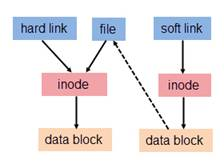

# linux---ln
ln, links, 创建链接文件的命令  


## 简介
链接文件，我理解软链接就是快捷方式，硬链接是同一个文件的文件别名  
1. 删除软链接和硬链接都不会对源文件有影响
2. 通过`rm`删除源文件后，软链接无法访问源文件，硬链接仍然可以访问源文件
3. 硬链接只适用于文件，不适用于目录
4. 因为软链接只是存储路径，硬链接是指向同一个node，所以软链接可跨文件系统，硬链接不可以


## 原理示意图
  


## 命令示例
软链接例子：  
```bash
# 源文件路径最好使用绝对路径
# ln -s <源文件路径> <链接路径>
ln -s /home/q/echo_hello /usr/local/bin/hello
```

硬链接例子：  
```bash
# ln <源文件路径> <链接路径>
ln /home/q/hello /home/x/world
```


## 参考链接
1. https://www.cnblogs.com/fqnb001/p/8778790.html
2. https://www.ibm.com/developerworks/cn/linux/l-cn-hardandsymb-links/index.html
