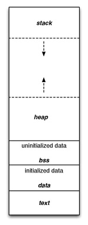

# 一个程序的内存空间分布

keywords: 内存分布  

  

```r
+----------------------+ high addr
|                      |
|  stack               |
|                      |
+- - - - - + - - - - - +
|          |           |
|          |           |
|          v           |
|                      |
|                      |
|          ^           |
|          |           |
|          |           |
+- - - - - + - - - - - +
|                      |
|                      |
|   heap               |
|                      |
|                      |
+----------------------+
|  uninitialized data  |
|                      |
|  bss                 |
+----------------------+
|  initialized data    |
|                      |
|  data                |
+----------------------+
|  text                |
|                      |
+----------------------+ low addr
```

bss  
名称来源 Block Started by Symbol  
属于静态内存分配，程序运行时的地址不变(开了ASLR也不变，利用这一点可以进行攻击)  
用来存放程序中未初始化的全局变量  

当该段有执行权限时，可以把shellcode写到该段进行利用  
