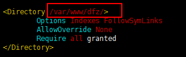
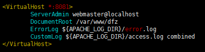

# linux---配置apache2端口映射相应目录

修改3个文件  
```r
/etc/apache2/apache2.conf
/etc/apache2/ports.conf
/etc/apache2/sites-available/000-default.conf
```

apache2.conf中，找类似下图的地方  
  
复制一个这样的东西出来，把红框所在的目录改成需要访问的目录，这样就允许了对这个目录的访问  

ports.conf中  
  
把需要监听的端口写成这样的形式就可以了，我这里监听8081-8083端口  

000-default.conf中，找类似下图的地方  
  
复制一个这样的东西出来，  
把 8081 改成之前设好的监听端口  
把 /var/www/dfz 改成之前设好的需要访问的目录  

最后重启apache即可，ubuntu下的开始、停止、重启  
```r
/etc/init.d/apache2 start
/etc/init.d/apache2 stop
/etc/init.d/apache2 restart
```


原链接: lym  


2017/9/2  
