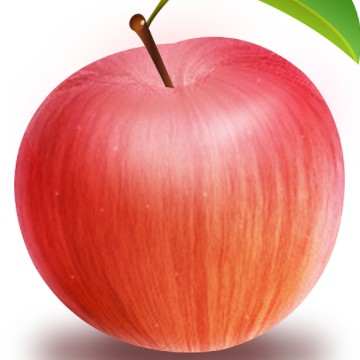

# pillow---分割合并一张图片

使用pillow把这张图片分割成9份，然后再合并到一起。  
  

分割的关键函数是 `crop`，需要提供左、上、右、下的元组(左和右相对于左边界，上和下相对于上边界)。  
合并的关键函数是 `paste`，实际上就是把小图片粘到一张大图片里。  

具体见该脚本: [split_and_combine.py](files/split_and_combine.py)  

参考链接：  
1. https://www.cnblogs.com/zrmw/archive/2019/09/05/11467046.html
2. https://fishpond.blog.csdn.net/article/details/112955064

---
2021/11/3  
