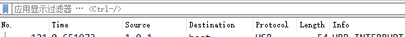
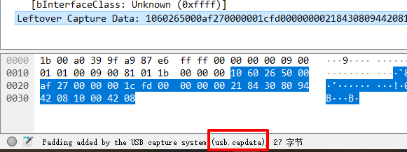

# tshark---基本过滤

tshark可以捕获流量，解析流量包，命令行工具。  
这里简单记一下tshark解析pcapng数据包  

## 提取wireshark解析出的部分字段
```bat
tshark -r http.pcap -T fields -e _ws.col.Length -e _ws.col.Info > http_info.txt
```
可以看到过滤的字段就是wireshark解析行的"Length"，"Info"  
  


## 提取数据部分
```bat
tshark -r usb-keyboard-data.pcap -T fields -e usb.capdata
```
提取数据时，如果不知道某个位置的名称，选中某段数据，看最下面一行就能知道具体名称  
  


2019/10/29  
