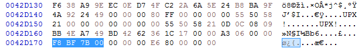
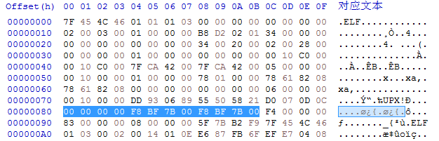

# upx脱壳---p_info损坏

样本hash: 7f28b2791ad94a202eea5e4c91d47cdeadca4723723427af574519f8aedbf15e  

upx加壳的程序，脱壳出错：  
```
upx: 7f28: CantUnpackException: p_info corrupted
```
p_info结构：  
```c
struct p_info       // 12-byte packed program header follows stub loader
{
    uint32_t p_progid;
    uint32_t p_filesize;
    uint32_t p_blocksize;
};
```
p_info在0x80-0x8b的位置，共12字节，被故意置零了  
  

在upx加壳程序的最后，往前数8个字节，看到的4字节(即倒数第9-12字节)表示p_filesize，而p_filesize 和
p_blocksize相同  
  

把p_filesize的值覆盖p_info的后8个字节即可  
  


参考链接：  
1. https://vcodispot.com/corrupted-upx-packed-elf-repair/
2. https://docs.ioin.in/writeup/blog.formsec.cn/_2018_01_29__E6_9F_90IOT_E8_A0_95_E8_99_AB_E7_97_85_E6_AF_92_E5_88_86_E6_9E_90_E4_B9_8BUPX_E8_84_B1_E5_A3_B3_E5_AE_9E_E6_88_98_/index.html


2021/9/6  
