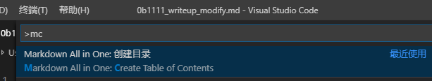

# vscode---Markdown All in One

写markdown需要的所有东西，键盘快捷键、目录、自动预览  

github地址: https://github.com/yzhang-gh/vscode-markdown  

这个插件最好用的功能就是自动生成目录  

光标放在开头  
Ctrl + Shift + P，输入 mc，回车即可  
  

可以在设置中把 "兼容GitHub" 勾选上  
  

2019/10/17  
