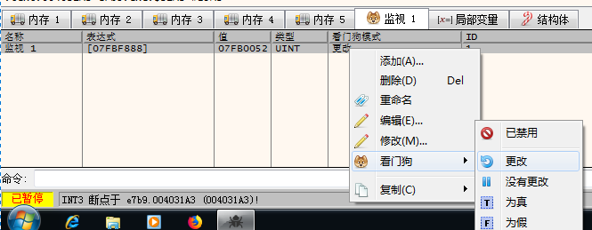
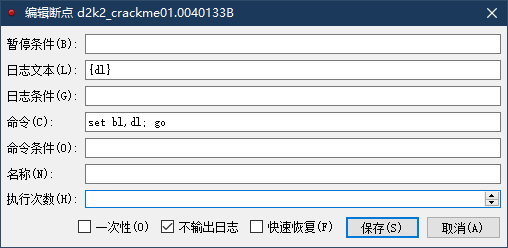
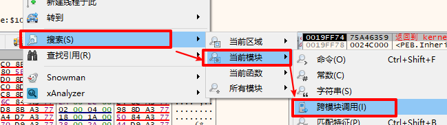

# x64dbg---使用经验

一些杂乱的x64dbg使用经验  

## 一些快捷键
`Ctrl + A` 分析模块，可自动分析出常见模式的函数区块  
`Ctrl + Home` 跳转到当前函数开头  
`Ctrl + End` 跳转到当前函数结尾  
`x` 查看调用当前函数方(也就是相互引用，需要在函数开头按)  


## 看门狗
可用于监测特定位置的数据变化  
  


## 断点日志
x64dbg的断点记录比较丰富，log命令参数建议用双引号包裹  
https://help.x64dbg.com/en/latest/commands/script/log.html  
这里是一些参数格式和示例：  
https://help.x64dbg.com/en/latest/introduction/Formatting.html  

一个输出举例，可以很方便看到一些输出字符串之类的  
```r
{utf16@[esp+4]}
{utf16@arg.get(0)}
```

断点命中次数和寄存器所指地址的字符串  
```r
{$breakpointcounter}:{ascii@rcx}
{$breakpointcounter}:{utf16@rcx}
```

指定内存的指定大小数据  
{mem;size@address} will print the size bytes starting at address in hex.  
举例，0032B378地址的4个字节  
```r
{mem;4@0032B378}
```

模块名、标签、注释  
```r
{modname@address}
{label@address}
{comment@address}
```


## 暂停条件或日志条件
`$breakpointcounter >= 20`
注意：这里的20是16进制  


## 断点命令
在断点处可以执行命令, 下方命令为: 将bl的值设为dl的值, 然后继续运行  
`set bl, dl; go`  
  
勾选"不输出日志"可以不输出断点被触发时的提示信息  

还可以直接改eip的值，然后继续运行  
`set eip, 401313; go`  

log记录某值到日志  
`log {ascii@ecx}`  

设置变量用于数量控制  
`set $num 0; set $num, $num+1`  

休眠，16进制，单位为毫秒  
`doSleep 3e8`  


## 给调用某一个api的所有位置下断点
x64dbg没有类似OD的bpx命令(有，但是功能不一样)  
可以 右键 --> 搜索 --> 当前模块 --> 跨模块调用  
  
按"反汇编"排序，找到相应的api，右键选择"在所有对***的调用上设置断点"  


## 修改程序
空格修改汇编代码  
文件 --> 补丁 --> 修补文件 即可  


## 导出小范围数据
选中数据，右键  
二进制编辑 --> 编辑 --> 复制数据 即可  


2020/7/13  
