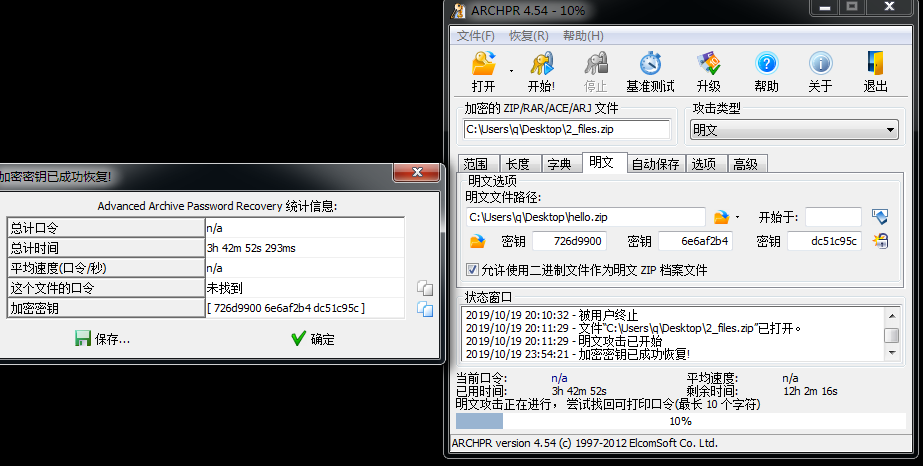

# zip明文攻击

假设a.zip中有hello.txt和word.txt，且该压缩包有密码  
而我们有hello.txt，且知道和上面压缩包里的hello.txt内容是一样的(可以通过对比两者的CRC32值来确认，大多数情况下应该是一样的)  

满足了上面的条件，就可以使用zip明文攻击来解压word.txt，获取该文件内容  
将hello.txt压缩为hello.zip  

工具为ARCHPR，在win7下运行效果较好  
  

注意点:  
1. 没有必要非等到拿到密码，中途停止，如果加密密钥恢复了，就可以直接把文件解压出来
2. 不要用bandizip/7z来压缩已知文件，可以用winrar或者其他压缩软件

2019/10/19  
