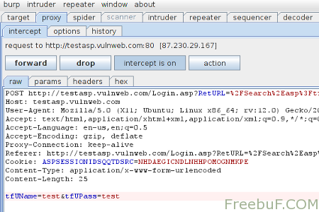

# 使用Burpsuite辅助Sqlmap进行POST注入测试

我们在使用Sqlmap进行post型注入时，经常会出现请求遗漏导致注入失败的情况。  
这里分享一个小技巧，即结合burpsuite来使用sqlmap，用这种方法进行post注入测试会更准确，操作起来也非常容易。  

1. 浏览器打开目标地址 http://testasp.vulnweb.com/Login.asp
2. 配置burp代理(127.0.0.1:8080)以拦截请求
3. 点击login表单的submit按钮
4. 如下图，这时候Burp会拦截到了我们的登录POST请求
      
5. 把这个post请求复制为txt, 我这命名为search-test.txt 然后把它放至sqlmap目录下
6. 运行sqlmap并使用如下命令：./sqlmap.py -r search-test.txt -p tfUPass，这里参数 -r 是让sqlmap加载我们的post请求rsearch-test.txt，而-p 大家应该比较熟悉，指定注入用的参数。

原链接: http://www.freebuf.com/sectool/2311.html  

2016/7/2  
