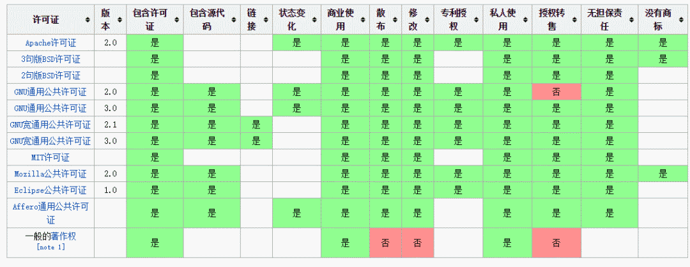

# 全球各种开源协议介绍
世界上的开源许可证（Open Source License）大概有上百种，今天我们来介绍下几种我们常见的开源协议。大致有GPL、BSD、MIT、Mozilla、Apache和LGPL等。  
  

下面先通过几张图来了解下什么情况下我们需要哪种协议，后续有专门的详细说明：  
  
  
  

## Apache License
Apache License（Apache许可证），是Apache软件基金会发布的一个自由软件许可证。  

Apache 协议 2.0 和别的开源协议相比，除了为用户提供版权许可之外，还有专利许可，对于那些涉及专利内容的开发者而言，该协议最适合。  

Apache 协议还有以下需要说明的地方:  

- **永久权利**: 一旦被授权，永久拥有。
- **全球范围的权利**: 在一个国家获得授权，适用于所有国家。
- **授权免费，且无版税**: 前期，后期均无任何费用。
- **授权无排他性**: 任何人都可以获得授权
- **授权不可撤消**: 一旦获得授权，没有任何人可以取消。比如，你基于该产品代码开发了衍生产品，你不用担心会在某一天被禁止使用该代码。

分发代码方面包含一些要求，主要是，要在声明中对参与开发的人给予认可并包含一份许可协议原文。  

## BSD
BSD是"Berkeley Software Distribution"的缩写，意思是"伯克利软件发行版"。  

BSD 在软件分发方面的限制比别的开源协议（如 GNU GPL）要少。该协议有多种版本，最主要的版本有两个，新 BSD 协议与简单 BSD 协议，这两种协议经过修正，都和 GPL 兼容，并为开源组织所认可。  
新 BSD 协议在软件分发方面，除需要包含一份版权提示和免责声明之外，没有任何限制。另外，该协议还禁止拿开发者的名义为衍生产品背书，但简单 BSD 协议删除了这一条款。  

## GPL
GPL （GNU General Public License） ：GNU通用公共许可协议。  

**Linux 采用了 GPL。**  

GPL协议和BSD, Apache Licence等鼓励代码重用的许可很不一样。GPL的出发点是代码的开源/免费使用和引用/修改/衍生代码的开源/免费使用，但不允许修改后和衍生的代码做为闭源的商业软件发布和销售。这也就是为什么我们能用免费的各种linux，包括商业公司的linux和linux上各种各样的由个人，组织，以及商业软件公司开发的免费软件了。  

## LGPL
LGPL是GPL的一个为主要为类库使用设计的开源协议。和GPL要求任何使用/修改/衍生之GPL类库的的软件必须采用GPL协议不同。LGPL允许商业软件通过类库引用(link)方式使用LGPL类库而不需要开源商业软件的代码。这使得采用LGPL协议的开源代码可以被商业软件作为类库引用并发布和销售。  

但是如果修改LGPL协议的代码或者衍生，则所有修改的代码，涉及修改部分的额外代码和衍生的代码都必须采用LGPL协议。因此LGPL协议的开源代码很适合作为第三方类库被商业软件引用，但不适合希望以LGPL协议代码为基础，通过修改和衍生的方式做二次开发的商业软件采用。  

GPL/LGPL都保障原作者的知识产权，避免有人利用开源代码复制并开发类似的产品。  

## MIT
MIT是和BSD一样宽范的许可协议,源自麻省理工学院（Massachusetts Institute of Technology, MIT），又称X11协议。作者只想保留版权,而无任何其他了限制。  

MIT与BSD类似，但是比BSD协议更加宽松，是目前最少限制的协议。这个协议唯一的条件就是在修改后的代码或者发行包包含原作者的许可信息。适用商业软件。使用MIT的软件项目有：jquery、Node.js。  

## MPL (Mozilla Public License 1.1)
MPL协议允许免费重发布、免费修改，但要求修改后的代码版权归软件的发起者 。这种授权维护了商业软件的利益，它要求基于这种软件的修改无偿贡献版权给该软件。这样，围绕该软件的所有代码的版权都集中在发起开发人的手中。但MPL是允许修改，无偿使用的。MPL软件对链接没有要求。  

## EPL (Eclipse Public License 1.0)
EPL允许Recipients任意使用、复制、分发、传播、展示、修改以及改后闭源的二次商业发布。  

使用EPL协议，需要遵守以下规则：  
1. 当一个Contributors将源码的整体或部分再次开源发布的时候,必须继续遵循EPL开源协议来发布,而不能改用其他协议发布.除非你得到了原"源码"Owner 的授权；
2. EPL协议下,你可以将源码不做任何修改来商业发布.但如果你要发布修改后的源码,或者当你再发布的是Object Code的时候,你必须声明它的Source Code是可以获取的,而且要告知获取方法；
3. 当你需要将EPL下的源码作为一部分跟其他私有的源码混和着成为一个Project发布的时候,你可以将整个Project/Product以私人的协议发布,但要声明哪一部分代码是EPL下的,而且声明那部分代码继续遵循EPL；
4. 独立的模块(Separate Module),不需要开源。

Creative Commons 知识共享协议
Creative Commons (CC) 许可协议并不能说是真正的开源协议，它们大多是被使用于设计类的工程上。 CC 协议种类繁多，每一种都授权特定的权利。 一个 CC 许可协议具有四个基本部分，这几个部分可以单独起作用，也可以组合起来。下面是这几部分的简介：

1. **署名** 作品上必须附有作品的归属。如此之后，作品可以被修改，分发，复制和其它用途；
2. **相同方式共享** 作品可以被修改、分发或其它操作，但所有的衍生品都要置于CC许可协议下；
3. **非商业用途** 作品可以被修改、分发等等，但不能用于商业目的。但语言上对什么是"商业"的说明十分含糊不清 (没有提供精确的定义)，所以你可以在你的工程里对其进行说明。例如，有些人简单的解释"非商业"为不能出售这个作品。而另外一些人认为你甚至不能在有广告的网站上使用它们。还有些人认为"商业"仅仅指你用它获取利益。
4. **禁止衍生作品**

CC 许可协议的这些条款可以自由组合使用。大多数的比较严格的CC协议会声明 "署名权，非商业用途，禁止衍生"条款，这意味着你可以自由的分享这个作品，但你不能改变它和对其收费，而且必须声明作品的归属。这个许可协议非常的有用，它可以让你的作品传播出去，但又可以对作品的使用保留部分或完全的控制。最少限制的CC协议类型当属 "署名"协议，这意味着只要人们能维护你的名誉，他们对你的作品怎么使用都行。  

CC 许可协议更多的是在设计类工程中使用，而不是开发类，但没有人或妨碍你将之用于后者。只是你必须要清楚各部分条款能覆盖到的和不能覆盖到的权利。  

原链接: http://mp.weixin.qq.com/s/wwlAH2MBAsujaPeqKqtjmw  

2018/03/12  
