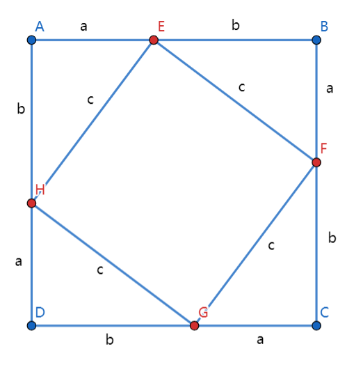

# 勾股定理简单证明

勾股定理：直角三角形的两条直角边的平方和等于斜边的平方。  

其中一种证明如下：  

  

```r
作正方形ABCD，
在边AB上取E，边BC上取F，边CD上取G，边DA上取H，
使得 AE=BF=CG=DH，
则 BE=CF=DG=AH，
则 三角形AEH、BFE、CGF、DHG全等，
则 四边形EFGH为正方形

设AE=a，AH=b，EF=c
正方形ABCD面积有2种表示方式，左右相等
(a+b)(a+b) = a*b/2 * 4 + c*c
a*a + 2*a*b + b*b = 2*a*b + c*c
a*a + b*b = c*c 

证毕
```


参考链接: https://xinzhi.wenda.so.com/m/a/1605259894202383  


2022/5/2  
