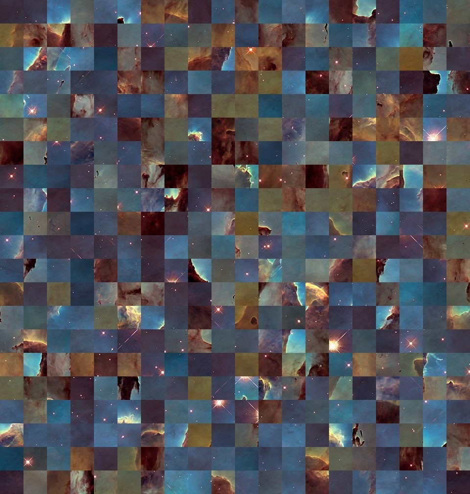

# 拼图工具gaps

github地址: https://github.com/nemanja-m/gaps  

gaps可以把一个乱序的拼图图片自动拼好。  

python3.9依赖不好解决，这里用python2.7安装：  
```r
sudo apt-get install python-tk
pip2 install --upgrade setuptools

git clone https://github.com/nemanja-m/gaps.git
cd gaps
pip2 install -r requirements.txt
pip install -e .
```

使用：  
```r
# size表示像素，48*48
./bin/create_puzzle images/pillars.jpg --size=48 --destination=images/puzzle.jpg
./bin/gaps --image=images/puzzle.jpg --generations=20 --population=600
```

puzzle  
  

pillars  
  


2022/1/12  
