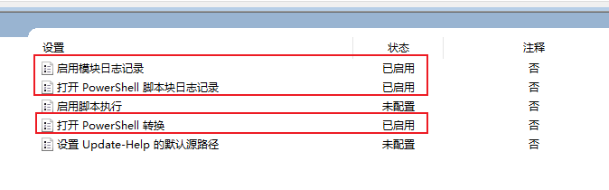
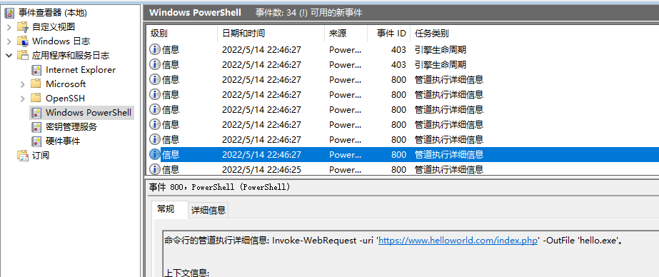

# 根据Windows日志获取powershell反混淆脚本

配置组策略，执行脚本后，通过事件查看器获取反混淆脚本。  
Win10天然支持，win7需要额外安装升级.Net平台，还没装成功过，具体见原链接。  

打开本地组策略编辑器，计算机配置->管理模板->"Windows 组件"->"Windows PowerShell"  
启用3个模块：  
```r
启用模块日志记录
打开 PowerShell 脚本块日志记录
打开 PowerShell 转换
```
  

执行脚本后，打开 事件查看器，应用程序和服务日志->"Windows PowerShell"  
事件ID为 800，任务类别为"管道执行详细信息"，往下点几个，就能找到原始未混淆的脚本。  
  


原链接: https://bbs.pediy.com/thread-261262.htm  


2022/5/14  
