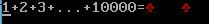

# 汇编---1加到10000输出乱码问题

&&&&&&& 遗留问题，不知道怎么解决  

看代码：  
```asm
	;主要思路是先用两个寄存器保存和，然后除以10000，这样就能把和分成两部分，通过对商和余数处理得到每一位，最后输出

jmp near start
	
message db '1+2+3+...+10000='

start:
	mov ax,0x7c0	;设置数据段的段基地址
	mov ds,ax
	
	mov ax,0xb800	;设置附加段基地址到显示缓冲区
	mov es,ax
	
	;以下显示字符串
	mov si,message
	mov di,0
	mov cx,start-message
turn1:
	mov al,[si]
	mov [es:di],al
	inc di
	mov byte [es:di],0x07
	inc di
	inc si
	loop turn1
	
	;以下计算1到10000的和
	xor ax,ax
	xor dx,dx
	mov cx,1
turn2:
	add ax,cx
	adc dx,0		;带进位加法指令 ADC(Addition Carry)  功能: OPRD1<--OPRD1 + OPRD2 + CF
	inc cx
	cmp cx,10000
	jle turn2		;小于等于则跳转
	
	;以下计算累加和的每个数位
	xor cx,cx		;设置堆栈段的段基地址，栈用来保存数位
	mov ss,cx       ;SS是段寄存器，不能直接传送立即数给SS
	mov sp,cx
	
	mov bx, 10000
	div bx                   ;dx放余数，ax放商 
	mov bp,ax                ;临时保存商     bp是基指针寄存器，临时存数应该没有问题
    mov ax,dx				 ;先处理余数，余数相当于低位
	mov bx,10
turn3:
    inc cx			;保存数位的个数，在显示的时候用到
	xor dx,dx 
	div bx
	push dx 
	cmp cx,4
	jne turn3	;ZF＝0,转至标号处执行
				;ZF：记录的是相关的指令执行完毕后，其执行的结果是否为  0 。
	
	mov ax,bp				;这里开始处理除以10000的商，也就是高位
turn4:
	inc cx
	xor dx,dx
	div bx
	push dx
	cmp ax,0
	jne turn4
	
	
	;以下显示各个数位
turn5:
	pop dx
	mov [es:di],dl
	inc di
	mov byte [es:di],0x04
	inc di
	loop turn5
	
	jmp near $
	
    times 510-($-$$) db 0
	db 0x55,0xaa
```

最后的结果就是，没有算出50005000，出来两个梅花图案。。  
  


2016/9/25  
