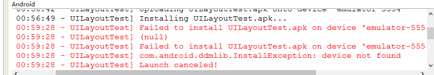

# 第一行代码-随手笔记

第一行代码，是一本教写Android的书，简单记一下。  

## 一些英文单词
```
intent      目的
category    类别
persistence 持久化
orientation 方向
cursor      指针
parse       解析
query       查询
URI     Universal Resource Identifier, 通用资源标识符
MIME    Multipurpose Internet Mail Extensions, 多用途互联网邮件扩展类型
```

## 开启模拟器
  
创建模拟器：点 Create 进去配一下就可以了  

## 创建项目

File -> New -> Android Application Project  
接下来就是一些配置选项加一路next了  

## Logcat打开
logcat是查看日志工具，很好用  

Window -> Show View -> Other -> logcat  

## 写app基本过程
基本过程：创建活动，创建布局，在AndroidManifest文件中注册  
1. 创建活动（跟java创建类一样），默认包下 右键 -> New -> Class
2. 创建布局 （控件都放在这里），Project下的 res文件夹下的 layout文件夹 右键 -> New -> Android XML File（如果没有layout文件夹，自己建一个）
3. 在活动中把布局和活动关联起来
4. 在AndroidManifest文件中注册活动

## 设置无标题栏
在活动的onCreate()方法中添加  
```java
requestWindowFeature(Window.FEATURE_NO_TITLE);
```
需要添加在 setContentView()之前  

## Logcat没有生成一个应用的默认过滤器 解决方法
首先在 AllMessages 中选中对应的应用消息，然后 右键 -> Filter similar messages...  
  
然后填相应的内容  
  
这样就会出现一个你的应用的过滤器

## 安装apk设备未找到 解决方法
如果模拟器开着，但是出现了这种情况  
  
一般的处理方法是切换到DDMS页面，重置一下adb就可以了  
右上角选择"DDMS"  
  
然后选择相应模拟器，右键 -> Reset adb  
  
就好了  

## 元素layout宽高设置
```
android:layout_width="match_parent"     表示让当前元素和父元素一样宽
android:layout_height="wrap_content"    表示当前元素的高度刚好包含里面的内容即可
```

## 元素大小单位
```r
px      pixel, 像素 
pt      磅数，1磅等于1/72英寸，一般作为字体的单位使用
dp      density independent pixels, 密度无关像素，一般用于控件显示，和px相比，它在不同密度屏幕中显示比例将保持一致
sp      scaled pixels, 可伸缩像素，主要用于字体显示
密度    屏幕每英寸所包含的像素数，通常以dpi为单位
```

## adb使用
1.adb存放在sdk下的platform-tools目录下
2.配置路径到环境变量  
    选中 我的电脑 右键 -> 属性 -> 高级 -> 环境变量，在系统变量里的Path中添加platform-tools目录  
3.使用  
    cmd下  
   ```
    adb shell  进入设备控制台
    cd  /data/data/com/example.databasetest/databases/  到数据库目录下
    sqlite3 BookStore.db  打开此数据库（这里就可以用SQL查询语句了，如：select * from Book）
    .table  查看表
    .schema  查看建表语句
    .exit  或 .quit 退出设备控制台
   ```

## 包下建包
如果用eclipse，在com包下建子包mysql，那包名应为com.mysql  
如果不用工具，那就是在com文件夹下再建一个文件夹  


---
2016/5/25  
