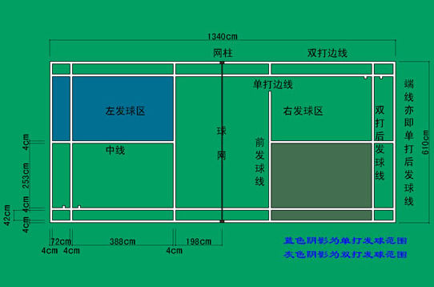

# 羽毛球相关

```
球场边界：
单打边界：底部以靠外面的线为界，两边以靠里面的线为界。
双打边界：底部以靠外面的线为界，两边以靠外面的线为界。
```
  

```
握姿：菜刀
正手：手心朝前，拇指下移，食指上移
反手：手背超前，拇指上移，食指下移

反手尽量把手腕立起来，手掌和手臂基本垂直

尽量保持球在身前或身侧

发球和打球一般要让球和拍面垂直

打球尽量使用寸劲(感觉和截拳道有点类似)

移动最好在对方发球后小跳一下或两下加速到指定位置

双打和队友配合补空缺，尽量面向来球方向


学习资料(可以在B站看):
肖杰&赵剑华<教你如何打羽毛球>
李在福羽毛球教学系列
```


2019/4/9  
