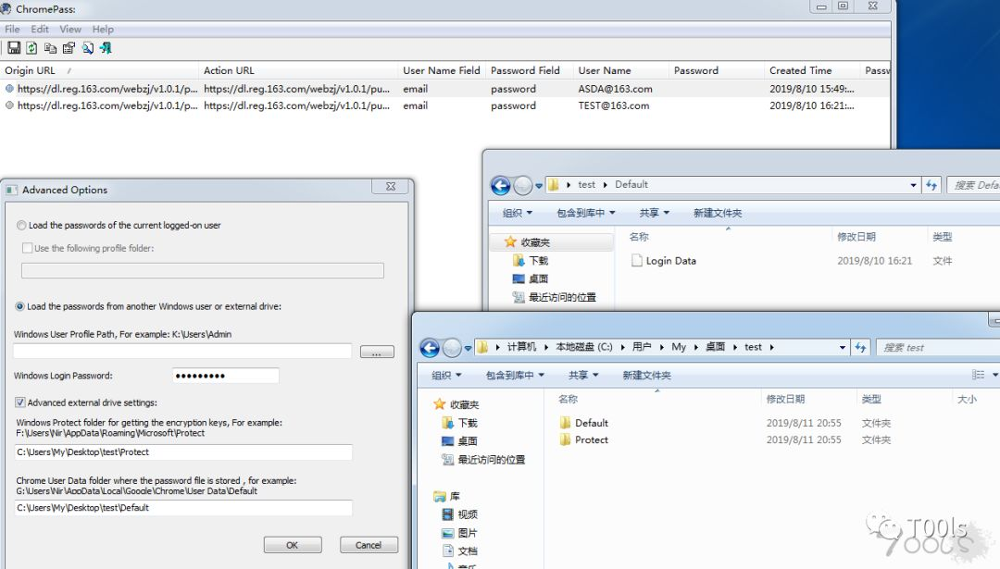

# 获取chrome保存密码

keywords: 谷歌浏览器  

使用工具: ChromePass http://www.nirsoft.net/utils/chromepass.html  

## 本机
直接运行 ChromePass 即可  

## 其它机器的文件
需要的文件：  
1. 密钥文件夹 主要是SID文件  
  C:\Users\test\AppData\Roaming\Microsoft\Protect  (test是用户名)  
2. Chrome的数据库文件Login Data  
  C:\Users\test\AppData\Local\Google\Chrome\User Data\Default\Login Data  (test是用户名)  

还需要知道目标机器的密码，操作见下图：  
  

---
原链接: T00ls.Net https://mp.weixin.qq.com/s/qTZuiTe8S8f87pvHJ5aP4g  

2019/8/29  
