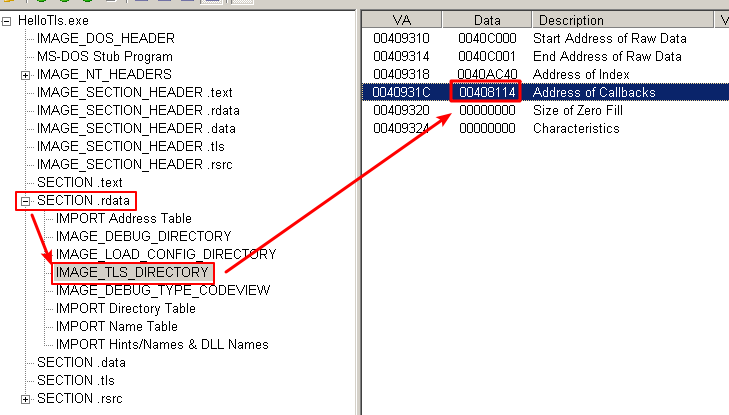
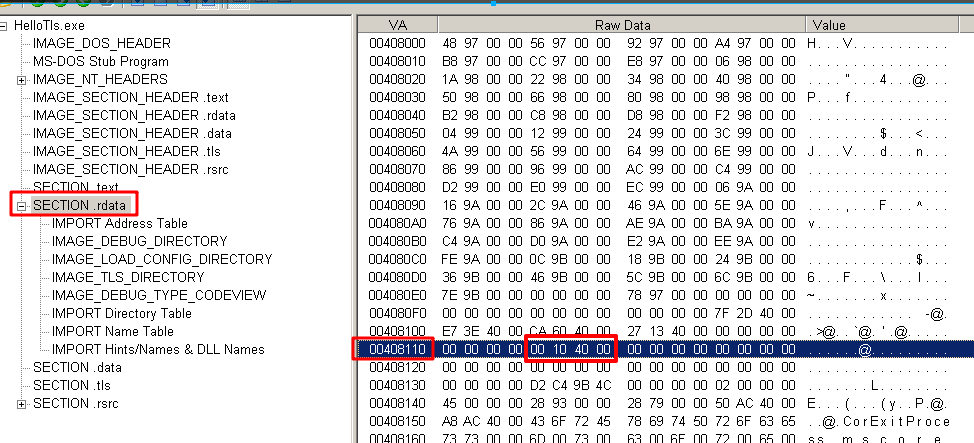
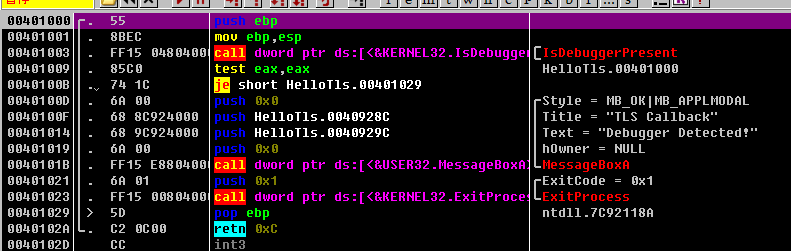

# 定位TLS回调函数

如果要调试，需要设置OD运行时第一次断点停在 System breakpoint  
Options -> Debugging Options -> Events  
Make first pause at: System breakpoint  

然后使用PE查看工具找到TLS回调函数的地址，举例如下:  
SECTION .rdata -> IMAGE_TLS_DIRECTORY -> Address of Callbacks  得到 0x00408114  
  

查看 0x00408114 地址的数据，为 0x00401000  
  

在OD中转到相应位置  
  

注意: TLS函数可能有多个  

2019/6/23  
