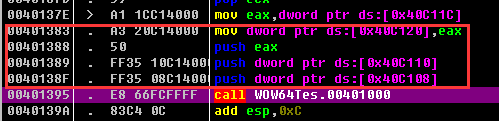

# 定位main函数

1. 根据特殊字符串，关键API  
2. 寻找call命令前连续push 3个指针的地方(不一定完全连续，就近即可)，且该call命令接近exit  
  如果是64位程序，找连续3个指针放到r8,rdx,rcx的特征  
  原因: main函数实际有3个指针参数  
    

3. 如果程序是基于控制台的应用程序，在GetCommandLine(A/W)下断，可以断在调用main函数之前的附近，可以结合方法2使用  
  原理: 调用main函数之前需要把main函数的参数存储到栈或寄存器中  

参考:
https://blog.csdn.net/yangbostar/article/details/5805965  

2019/6/18  
