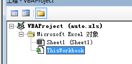
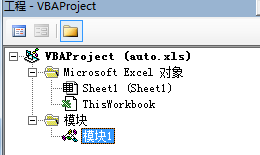

# excel---自动执行宏

如果想让宏在打开xls文件时就自动执行，有两种方式，第1种方法比较好用  

## 方法1
将宏代码放在 ThisWorkbook 中  
  

要自动执行函数的函数名为 Workbook_Open  

## 方法2
新建模块，将宏代码放在新的模块中
  

要自动执行函数的函数名为 Auto_Open 或者 autoopen  

---
参考: http://www.360doc.com/content/17/0416/08/30583536_645952001.shtml  

---
2019/4/15  
