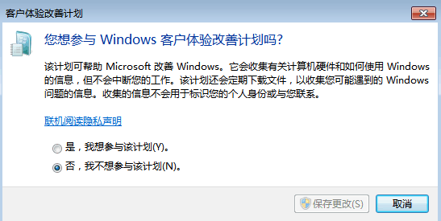
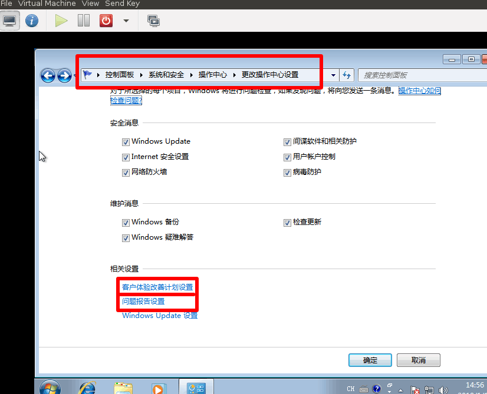
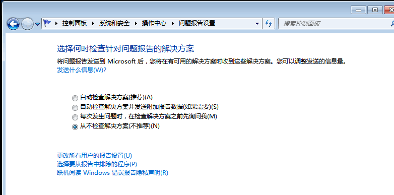

# win7_x64关闭watson.microsoft.com访问

win7_x64老是去连一个没有回应的域名watson.microsoft.com，这个可以关闭  

删除注册表项  
```
1. Click Start, click Run, type regedit.exe in the Open box, and then click OK.
2. Locate and then click the following registry key: 
    HKEY_LOCAL_MACHINE\Software\Microsoft\Windows NT\CurrentVersion\AeDebug 
    NOTE: Steps three and four are optional, However, they are necessary if you want to restore the default use of Dr. Watson. 
3. Click the AeDebug key, and then click Export Registry File on the Registry menu.
4. Type a name and location for the saved registry file, and then click  Save.
5. Delete the AeDebug key.
```

关闭“客户体验改善计划”和“问题报告”  
  
  
  


参考: https://support.microsoft.com/en-us/help/188296/how-to-disable-or-enable-dr-watson-for-windows  

感谢客服小哥哥/小姐姐的帮忙  


2019/1/15  
