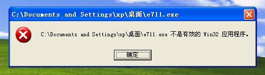

# 做恶意软件的思路

因为杀毒软件很精明，所以尽量把自己装成一个废柴推广软件，把自己的行为隐藏在这个软件下面  

可以隐藏的文件类型有：
1. 软件推广软件，就是那种一安装就会捆绑很多其他软件的东西
2. 软件安装包
3. 模拟系统提示软件无法正常执行的界面(如dllmain无法正常加载，NSIS安装包由于不完整安装失败界面)，做好真实代码隐藏和混淆工作
4. swf小游戏，这个风险有点高，因为可以反编译，注意做好代码混淆工作
5. VB 5.0/6.0的程序，这个只是增加反编译的难度，但敏感行为还是一览无余

说到底，要让病毒分析者一看，这就是个容易引起误报的软件，这就是不完整无法正常执行的软件，这就是个简单的小游戏，根本不是精心设计的恶意软件  

部分界面如下  
  

2019/3/27  
