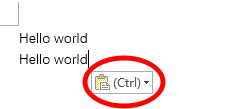
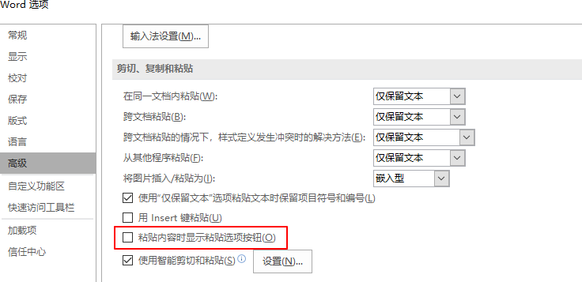

# 关闭word中粘贴后出现的Ctrl图标

word中粘贴文字后出现下面的图标，其实是word的一个功能，用来选择粘贴的格式  
  

可以在下方所示地方取消显示图标：文件-->选项-->高级-->剪切、复制和粘贴  
取消勾选 粘贴内容时显示粘贴选项按钮  
  

虽然这样可以关闭Ctrl图标，不过粘贴的格式会有异常，还是别关了，可以随便复制一下文档里别的东西，就没有Ctrl图标了  

2018/3/16  
