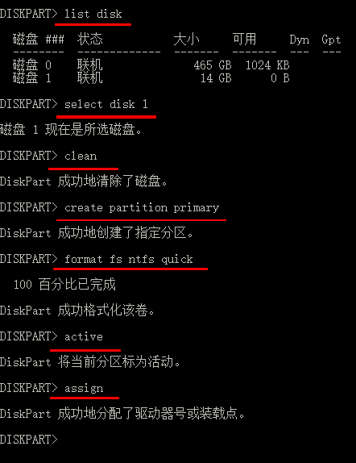

# 制作U盘引导盘

keywords: 装系统 U盘启动盘  

这个严格意义不叫启动盘，只是我习惯这样叫了，装系统用的  

## `最简单的方法`

不需要用任何特殊工具，需要的只是普通的windows和一个解压软件  

首先对U盘的文件系统格式有要求：  
windows格式化U盘可以有NTFS、FAT32、exFAT 3种  
NTFS和exFAT都可以，FAT32不可以是因为有一个文件解压之后大小超过了4G，而FAT32不支持单个文件大小超过4G  

之后就是去https://msdn.itellyou.cn/下载相应的iso镜像，解压放到U盘即可，目录举例如下：  
```r
F:\boot
F:\efi
F:\sources
F:\support
F:\autorun.inf
F:\bootmgr
F:\bootmgr.efi
F:\setup.exe
```
这里的F指的是我U盘的盘符  

如果电脑太老，可能这种U盘无法识别为引导盘，还是要用diskpart  

2018/10/4  


## `diskpart制作U盘引导盘`

diskpart是windows自带的工具，按Win+R输入 diskpart即可打开  
  

命令就这些：  
```r
list disk
select disk 1  # 这里一定注意要选择U盘对应的标号  
clean
create partition primary
format fs ntfs quick
active
assign
```

然后就可以解压一个iso镜像，把所有文件复制到U盘根目录下，愉快地装系统了  

原链接：http://hubuxcg.blog.51cto.com/2559426/933435  

2017/9/2  
