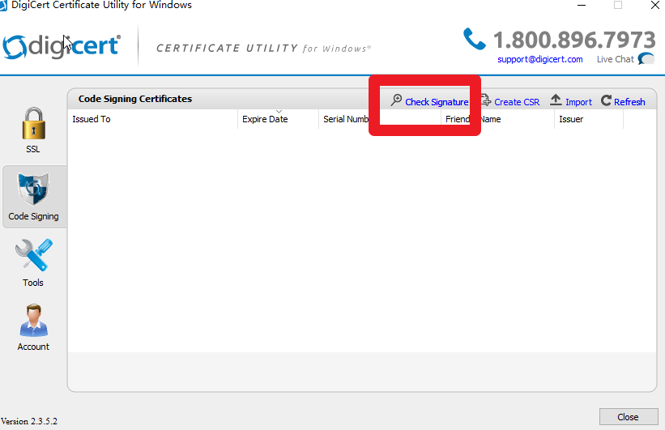

# 查看PE自身证书链

有时候PE自身只包含一部分证书链，但windows上查看证书链无法确认PE自身包含哪些证书。  
可以使用DigiCertUtil或者manalyze确认。  

## DigiCertUtil
下载DigiCertUtil: https://www.digicert.com/util/DigiCertUtil.zip  

选择"Check Signature"，打开相应文件即可查看，效果如下  
  

如果想导出相应证书，可以右键 可执行程序 查看 数字证书，然后导出  
  


## manalyze
下载manalyze  
https://manalyzer.org/static/manalyze_win32.zip  
https://manalyzer.org/static/manalyze_x64.zip  
执行命令为:  
```r
manalyze.exe -x ./ hello.exe
```
hello.p7b 即为导出的所有证书，双击可查看  


---
2019/11/5  
