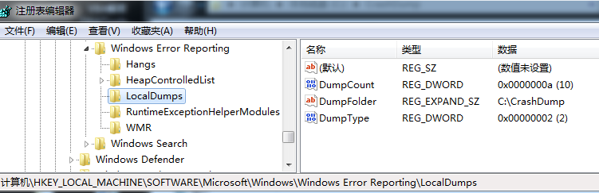

# 设置注册表保存dump文件

在程序崩溃后，如果窗口还在，可以打开任务管理器，右键保存 dump 文件。  
如果不会存在崩溃窗口，可以通过设置注册表项来保存 dump 文件。  

需要在 `HKEY_LOCAL_MACHINE\SOFTWARE\Microsoft\Windows\Windows Error Reporting` 下新建 `LocalDumps` 项，然后在该项下创建3个键：  
```r
DumpCount     REG_DWORD       0x0000000a
DumpFolder    REG_EXPAND_SZ   C:\CrashDump
DumpType      REG_DWORD       0x00000002
```
DumpCount 表示最多保存 dump 文件的个数  
DumpFolder 表示保存 dump 文件的文件夹  
DumpType 表示保存 dump 文件的类型，可以是：  
```r
0 = Create a custom dump  
1 = Mini dump  
2 = Full dump  
```

这里设置如下图：  
  


参考链接： 
1. https://blog.csdn.net/zjc_game_coder/article/details/78486249?utm_medium=distribute.pc_relevant.none-task-blog-baidujs-1
2. https://docs.microsoft.com/en-us/windows/win32/wer/collecting-user-mode-dumps  


2020/6/12  
